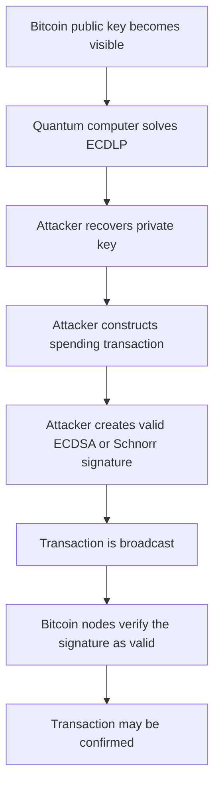

# Shor’s Algorithm and the Discrete-Log Threat

Bitcoin uses elliptic-curve digital signatures to determine whether a transaction is authorized. Both ECDSA and BIP340 Schnorr signatures ultimately rely on the assumption that, given a public key, it is computationally infeasible to recover the corresponding private key.

For classical computers, this assumption is supported by the difficulty of the **elliptic-curve discrete logarithm problem**, or ECDLP. The best known generic classical algorithms require an impractical amount of computation against Bitcoin’s secp256k1 parameters. But, a sufficiently capable fault-tolerant quantum computer would change this security model. Shor’s algorithm provides a polynomial-time quantum method for solving discrete-logarithm problems. If implemented at the necessary scale, it could derive a Bitcoin private key from an exposed secp256k1 public key.

This chapter explains:

- what the discrete-logarithm problem is,
- how it protects Bitcoin public keys,
- why Shor’s algorithm changes the problem,
- how that affects ECDSA and Schnorr signatures,
- what resources a practical attack would require,
- and what the threat does and does not imply for Bitcoin.

## 1. Learning objectives

After reading this chapter, a reader should be able to explain:

1. What the elliptic-curve discrete logarithm problem is.
2. Why secp256k1 public keys are secure against known classical attacks.
3. What Shor’s algorithm changes asymptotically.
4. Why both ECDSA and BIP340 Schnorr signatures are affected.
5. Why public-key exposure is a prerequisite for this attack.
6. The difference between logical and physical qubits.
7. Why quantum gate count and runtime matter in addition to qubit count.
8. Why published resource estimates are not fixed predictions of an attack date.
9. How a recovered private key could be used to steal Bitcoin without violating consensus rules.
10. What parts of Bitcoin are not directly attacked by Shor’s algorithm.

## 2. Threat

The core post-quantum signature threat to Bitcoin is:

> Given a visible secp256k1 public key \(P=dG\), a sufficiently capable quantum computer running Shor’s algorithm could recover the private scalar \(d\).

Once \(d\) is recovered, the attacker can create signatures that Bitcoin nodes will verify as valid. The nodes cannot distinguish between:

- a signature produced by the legitimate owner, and
- a signature produced by an attacker who recovered the same private key.

The attack therefore breaks the assumption that knowledge of the private key is limited to the legitimate owner.

## 3. Classical difficulty of the ECDLP

No efficient classical algorithm is known for solving the discrete logarithm problem on a properly selected general elliptic curve such as secp256k1. The best generic classical attacks include algorithms such as Pollard’s rho method. Their expected work grows approximately as:

\[
O(\sqrt{n})
\]

group operations. The secp256k1 subgroup order \(n\) is approximately \(2^{256}\), so a generic square-root attack requires work on the order of:

\[
2^{128}
\]

elliptic-curve operations. This is the origin of the approximate 128-bit classical security level associated with secp256k1. A 256-bit private key does not mean that the best classical attack necessarily requires \(2^{256}\) steps. Generic discrete-log attacks obtain a square-root speedup, but \(2^{128}\) operations is still far beyond practical classical computation.

## 4. What Shor’s algorithm changes

Peter Shor introduced quantum algorithms for integer factorization and discrete logarithms. Classical generic ECDLP attacks require work exponential in roughly half the key size. Shor’s quantum algorithm solves the discrete-logarithm problem in time polynomial in the bit length of the group parameters. For a group with parameters represented using \(m\) bits:

```text
Classical generic attack:
approximately exponential in m

Shor’s quantum algorithm:
polynomial in m
```

This does not mean the quantum computation is easy. A real implementation still requires:

- a large fault-tolerant quantum computer,
- error-corrected logical qubits,
- reversible elliptic-curve arithmetic,
- a very large number of quantum gates,
- sufficiently low error rates,
- and enough runtime stability to complete the computation.

## 5. Why a quantum computer helps

Quantum computers do not simply try every private key one by one. Shor’s algorithm uses quantum superposition, interference and a quantum Fourier transform to recover hidden periodic or algebraic structure in a mathematical problem. For an elliptic-curve discrete logarithm, the attacker knows:

\[
P=dG
\]

but does not know \(d\). A high-level quantum construction considers combinations of the form:

\[
F(a,b)=aG+bP.
\]

Substituting \(P=dG\) gives:

\[
F(a,b)=(a+bd)G.
\]

Different pairs \((a,b)\) can produce the same elliptic-curve point. If:

\[
F(a,b)=F(a',b'),
\]

then:

\[
(a-a')+d(b-b')\equiv 0 \pmod n.
\]

These equalities contain information about the unknown scalar \(d\). A quantum computer can evaluate the group relation over a superposition of many values and use a quantum Fourier transform to extract information about the hidden relation. Classical post-processing then recovers \(d\). This description omits many circuit-level details, but it captures the central idea:

> Shor’s algorithm does not search through all Bitcoin private keys. It exploits the algebraic structure of the elliptic-curve group.

## 6. Simplified stages of an elliptic-curve quantum attack

A simplified attack can be viewed in five stages.

### Stage 1: Obtain the public key

The attacker identifies a secp256k1 public key:

\[
P=dG.
\]

The public key may already be visible in an output, script, previous transaction, or other published data. It may instead become visible when the owner broadcasts a spending transaction.

### Stage 2: Construct the quantum computation

The quantum circuit implements reversible arithmetic for:

- finite-field addition,
- finite-field multiplication,
- modular inversion,
- elliptic-curve point addition,
- and scalar multiplication.

These operations must be expressed using reversible quantum gates.

### Stage 3: Extract the hidden group relation

The quantum computer evaluates the relevant group function in superposition and applies a quantum Fourier transform or related hidden-subgroup procedure. Measurements produce information related to the unknown discrete logarithm.

### Stage 4: Perform classical post-processing

The measurement results are processed using an ordinary classical computer. Sufficient valid samples allow the attacker to solve for \(d\).

### Stage 5: Verify and use the recovered key

The attacker checks that:

\[
dG=P.
\]

Once verified, the recovered private key can be used with ordinary Bitcoin signing software to create valid ECDSA or Schnorr signatures. The quantum computer is only required for private-key recovery. It is not required for constructing or broadcasting the final Bitcoin transaction.

## 7. Impact on ECDSA

ECDSA uses a secp256k1 private key \(d\) and public key:

\[
P=dG.
\]

An ECDSA signature authorizes a message using the private key. Verification uses the corresponding public key. If an attacker recovers \(d\) from \(P\), the attacker can generate new ECDSA signatures for arbitrary transactions. This bypasses the normal security assumption underlying the signature scheme. The attacker does not need to:

- break the ECDSA verification algorithm,
- modify Bitcoin Core,
- exploit a wallet bug,
- guess a seed phrase,
- or persuade nodes to accept an invalid signature.

The attacker simply creates a cryptographically valid signature using the recovered key.

## 8. Impact on BIP340 Schnorr signatures

BIP340 Schnorr signatures also use secp256k1. Although Schnorr signatures have several engineering and security-analysis advantages over ECDSA, the public-key relation remains:

\[
P=dG.
\]

BIP340’s security analysis assumes that the elliptic-curve discrete logarithm problem is hard. If Shor’s algorithm makes the ECDLP practical, an attacker can recover the Schnorr private key just as they can recover an ECDSA private key. Therefore:

> Schnorr signatures improve Bitcoin’s current classical signature design, but they are not post-quantum signatures.

## 9. The Bitcoin attack path

A Bitcoin theft based on Shor’s algorithm would conceptually follow this flow:



The attack does not require Bitcoin nodes to malfunction. Bitcoin nodes correctly apply the existing validation rules. The failure occurs because a cryptographic assumption beneath those rules is no longer valid.

## 10. Public-key exposure is the attack gateway

Shor’s discrete-log attack requires a public key. A Bitcoin address, script hash, or public-key hash is not always the same thing as an exposed public key. Different output types reveal different data at different times. At a high level, Bitcoin outputs can be divided into categories such as:

1. **Public key already visible**
2. **Public key hidden behind a hash until spend**
3. **Public key contained inside a script revealed only when spent**
4. **Tweaked elliptic-curve public key visible from output creation**
5. **Key reused after a previous transaction revealed it**

This produces different attack windows.

### 10.1 Already-exposed public keys

If a public key is already visible, the attacker may have a long period in which to run the quantum computation. The target may remain stationary while the attacker works. This is commonly called a long-exposure or at-rest attack.

### 10.2 Public keys revealed during spending

Some outputs commit to a hash of a public key. The full public key is revealed only when the owner spends the output. In this case, an attacker would need to:

1. observe the spending transaction,
2. recover the private key,
3. construct a competing transaction,
4. and have that transaction confirmed before the legitimate spend becomes final.

This produces a much shorter attack window and is often called an on-spend or short-exposure attack.

## 11. Hashing a public key delays exposure; it does not replace the signature scheme

An output containing a public-key hash may prevent a Shor-based attacker from immediately seeing the full public key. For example, a fresh P2PKH or P2WPKH output normally contains a hash derived from the public key rather than the public key itself. However, this protection has important limitations.

### The public key is revealed during spending

The spending transaction normally reveals:

- the public key,
- and the signature.

Once the transaction is broadcast, the public key becomes visible.

### Reusing a key defeats the delay

If the same public key controls multiple outputs and has already been revealed in an earlier transaction, an attacker may begin working on it before the remaining outputs are spent.

### The signature remains elliptic-curve based

Hashing the public key does not convert ECDSA or Schnorr into a post-quantum signature scheme. It changes when the attack input becomes available.

> Public-key hashing can reduce exposure time, but it does not remove the discrete-logarithm vulnerability once the public key is known.

## 12. Logical and physical qubits

Quantum resource discussions commonly distinguish between **physical qubits** and **logical qubits**.

### 12.1 Physical qubits

Physical qubits are the actual hardware components used by a quantum computer. They are noisy and can suffer from:

- decoherence,
- imperfect gates,
- measurement errors,
- state-preparation errors,
- and connectivity limitations.

### 12.2 Logical qubits

A logical qubit is an error-corrected qubit encoded across multiple physical qubits. Quantum error correction allows a computation to proceed reliably even though individual physical components are imperfect. A single logical qubit may require many physical qubits. The exact overhead depends on:

- physical error rate,
- error-correcting code,
- target logical error rate,
- architecture,
- connectivity,
- gate speed,
- and computation depth.

## 13. Gate counts and circuit depth

Qubit count alone does not determine whether an attack is practical. A quantum circuit must also execute a large number of logical operations. Resource estimates often report quantities such as:

- Toffoli gate count,
- T-gate count,
- circuit depth,
- measurement count,
- error-correction cycles,
- and total runtime.

A **Toffoli gate** is a three-qubit reversible logic gate. It is frequently used as a unit when estimating the cost of reversible arithmetic. Elliptic-curve Shor circuits require operations such as modular multiplication and inversion. These can dominate the total gate cost. Two proposed circuits may trade qubits for gates:

- one may use fewer qubits but require more gates,
- another may use more qubits to reduce runtime or gate count.

## 14. Fault tolerance is essential

Shor’s algorithm for secp256k1 cannot be run successfully on an ordinary noisy quantum device at the required scale. The computation is long enough that accumulated errors would destroy the result unless the machine supports fault-tolerant logical operations. A practical attack requires:

- stable logical qubits,
- sufficiently low logical error rates,
- repeated error-correction cycles,
- efficient magic-state or non-Clifford gate production,
- reliable measurement,
- and enough system uptime to finish the circuit.

This is why demonstrations of small quantum algorithms do not imply that Bitcoin keys can presently be recovered. The gap between:

- running a toy discrete logarithm,
- and attacking a 256-bit elliptic curve

is enormous.

## 15. Evolution of resource estimates

Quantum resource estimates have improved as researchers have developed better:

- reversible arithmetic,
- circuit decompositions,
- error-correction models,
- qubit-routing strategies,
- and hardware assumptions.

| Work | Main contribution | Interpretation |
|---|---|---|
| Shor’s original work | Demonstrated polynomial-time quantum algorithms for factoring and discrete logarithms | Established the theoretical vulnerability |
| Roetteler et al. (2017) | Produced explicit circuit estimates for elliptic-curve discrete logarithms over prime fields | Translated asymptotic vulnerability into gate- and qubit-level estimates |
| Babbush et al. (2026) | Proposed substantially reduced resource estimates for 256-bit ECDLP and analyzed fast-clock cryptocurrency attacks | Suggests a smaller attack threshold under specified architectural assumptions |

### 15.1 The 2017 resource estimates

Roetteler, Naehrig, Svore, and Lauter developed reversible circuits for elliptic-curve arithmetic and estimated the resources required to solve ECDLP over an \(m\)-bit prime field. Their general upper-bound estimate used approximately:

\[
9m+2\lceil\log_2 m\rceil+10
\]

algorithmic qubits and a Toffoli-gate count bounded by an expression scaling approximately as:

\[
O(m^3\log m).
\]

### 15.2 The 2026 cryptocurrency-focused estimates

A 2026 whitepaper by Babbush and co-authors reported two alternative circuit tradeoffs for a 256-bit elliptic-curve discrete logarithm:

- fewer than 1,200 logical qubits and fewer than 90 million Toffoli gates, or
- fewer than 1,450 logical qubits and fewer than 70 million Toffoli gates.

The paper also estimated that, under a particular superconducting hardware model with specified error-rate and connectivity assumptions, the circuits could run in minutes using fewer than half a million physical qubits.

Though these figures are:

- circuit and architecture estimates,
- dependent on error rates and hardware assumptions,
- not descriptions of an existing machine,
- and not a guaranteed prediction of when such a machine will be built.

## 16. Fast-clock and slow-clock quantum architectures

The usefulness of a quantum computer for a Bitcoin attack depends on more than total qubit capacity. Gate speed matters. A machine that requires days or months to recover a private key may threaten public keys exposed indefinitely but may not be fast enough to race a transaction in the mempool. A machine capable of completing the same attack in minutes creates a different threat model. A useful distinction is:

- **Fast-clock architecture:** logical operations are executed quickly enough that an on-spend attack may become plausible.
- **Slow-clock architecture:** the machine may threaten long-exposed keys but may be unable to finish before an ordinary transaction confirms.

This distinction connects quantum hardware to Bitcoin’s two exposure models:

| Attack model | Required quantum capability |
|---|---|
| Long-exposure attack | Complete key recovery before the owner moves the output |
| Short-exposure attack | Complete key recovery and replacement transaction before confirmation |
| Dormant-key attack | Runtime may be relatively less important if the key remains exposed indefinitely |
| Mempool race | Runtime, transaction propagation, fees, and miner selection all matter |

## 17. What current quantum computers cannot do

Current quantum computers do not have the fault-tolerant logical capacity needed to execute Shor’s algorithm against secp256k1. They may demonstrate:

- small factoring problems,
- toy discrete logarithms,
- short quantum circuits,
- error-correction milestones,
- or specialized quantum simulations.

These achievements are scientifically important, but they do not constitute attacks on real Bitcoin keys. A credible secp256k1 attack would require a system capable of reliably executing a large, deeply error-corrected arithmetic circuit.

## 18. What Shor’s algorithm does not do

Shor’s algorithm is powerful, but it is often described too broadly.

### 18.1 It does not directly reverse SHA-256

Shor’s algorithm targets problems such as factoring and discrete logarithms. It is not a generic hash inversion algorithm.

### 18.2 It does not automatically reveal a key from only its hash

If an output contains only a public-key hash and the full public key has never been revealed, the direct elliptic-curve discrete-log attack does not yet have its required input. An attacker would first need the full public key or would need to attack the hash construction through a separate method.

### 18.3 It does not directly rewrite Bitcoin’s history

Recovering a private key enables unauthorized spending of coins controlled by that key. It does not directly produce proof of work or allow arbitrary old blocks to be rewritten.

### 18.4 It does not violate signature verification

A quantum attacker produces an ordinary valid signature after recovering the key. The signature-verification code continues to function exactly as specified.

### 18.5 It does not imply that all Bitcoin outputs are equally exposed

The attack window depends on:

- output type,
- key reuse,
- script structure,
- whether the key has already been revealed,
- and whether a spend is currently visible in the mempool.

### 18.6 It does not define a migration solution

Shor’s algorithm explains the vulnerability. It does not determine which post-quantum signature scheme, output type, activation mechanism, or migration policy Bitcoin should adopt.

## 19. Bitcoin-specific consequences of private-key recovery

If elliptic-curve private-key recovery becomes practical, several Bitcoin use cases are affected.

### 19.1 Single-key outputs

An attacker who recovers the private key can sign a transaction spending the output.

### 19.2 Reused keys

If one public key controls multiple outputs, recovering its private key may compromise all unspent outputs controlled by that key. This is one reason address and key reuse are particularly harmful in a post-quantum threat model.

### 19.3 Script-based multisignature

If a script contains multiple elliptic-curve public keys, a quantum attacker may need to recover enough corresponding private keys to satisfy the threshold. For an \(m\)-of-\(n\) policy, recovering at least \(m\) relevant private keys may allow an attacker to spend. The attack window depends on whether the script and keys are already visible or are revealed only during spending.

### 19.4 Aggregated Schnorr keys

A multiparty protocol may produce an aggregate secp256k1 public key that appears on-chain as one ordinary key. If an attacker can solve the discrete logarithm for that aggregate public key, the attacker can recover the scalar corresponding to the aggregate key and produce a valid signature without reconstructing the participants’ original key shares. On-chain privacy and aggregation do not provide post-quantum security when the aggregate key itself is elliptic-curve based.

### 19.5 Timelocked outputs

A timelock prevents spending before a specified time or block height. It does not prevent an attacker from deriving the private key in advance. Once the timelock expires, both the legitimate owner and the attacker may be able to produce a valid spend.

### 19.6 Cold storage

Keeping a private key offline protects against online compromise. It does not prevent a quantum attacker from recovering that private key from an already exposed public key. Cold storage remains useful against many classical threats, but it does not change the mathematical public-key relation.

## 20. Why a quantum-generated signature is hard to identify

Bitcoin nodes validate mathematical conditions. They do not know how the signer obtained the private key. Suppose both the legitimate owner and an attacker know the same private key. Either party can produce a valid signature. From the node’s perspective:

```text
valid owner signature
and
valid attacker signature
```

are indistinguishable. There is no cryptographic marker indicating:

- whether Shor’s algorithm was used,
- who knew the key first,
- whether the coin had been considered lost,
- or whether the signature reflects the original owner’s intent.

This creates difficult migration and recovery questions. Once the classical private key has been recovered, ordinary signature verification cannot distinguish legitimate ownership from quantum theft.

## 21. Implications for Bitcoin readiness

The Shor threat suggests several areas of preparation.

### 21.1 Classify public-key exposure

Wallets and researchers need to understand which UTXOs have:

- directly visible public keys,
- public keys revealed through previous reuse,
- keys hidden until spend,
- or script-dependent exposure.

### 21.2 Avoid unnecessary key reuse

Key reuse can turn a short-exposure output into a long-exposure target. Wallets should already avoid reuse for privacy and security reasons.

### 21.3 Evaluate new output types

Bitcoin may need output designs that do not rely solely on long-exposed elliptic-curve public keys. BIP360/P2MR is one proposal that addresses part of this design space by removing Taproot’s ordinary key-path spend. It does not itself define a post-quantum signature scheme.

### 21.4 Evaluate post-quantum signatures

A complete long-term solution may require a signature mechanism whose security does not rely on the elliptic-curve discrete logarithm problem. Candidates must be evaluated for:

- public-key size,
- signature size,
- verification cost,
- implementation complexity,
- consensus determinism,
- hardware-wallet compatibility,
- state-management risk,
- multisignature support,
- and migration cost.

## 22. Open questions

Several questions remain unresolved:

1. How should Bitcoin classify UTXOs by exposure and migration urgency?
2. Which output types should be supported for voluntary post-quantum migration?
3. Which post-quantum signature family is most suitable for Bitcoin?
4. How should Bitcoin account for large signatures and verification costs?
5. Can exposed legacy coins be migrated safely after a fast quantum attacker exists?
6. Should vulnerable signature types eventually be restricted?
7. How should Bitcoin treat coins whose owners do not migrate?
8. Can rescue mechanisms distinguish original owners from quantum attackers?
9. How should threshold wallets and aggregated-key wallets migrate?
10. What readiness signals should wallets, exchanges, and custodians monitor?
11. How should resource estimates be communicated without creating either panic or complacency?
12. What test infrastructure should be built before a consensus proposal is considered?

## 23. Summary

Bitcoin’s ECDSA and Schnorr signatures depend on the hardness of the elliptic-curve discrete logarithm problem. The public-key relation is:

\[
P=dG.
\]

Classically, recovering \(d\) from \(P\) requires an impractical amount of computation for secp256k1.

Shor’s algorithm changes this by providing a polynomial-time quantum algorithm for discrete logarithms. A practical attack would still require:

- an exposed public key,
- a large fault-tolerant quantum computer,
- enough logical qubits,
- a sufficiently low error rate,
- millions of non-trivial quantum gates,
- and enough runtime to complete the computation before the target output moves.

If the attack succeeds, the recovered private key can be used to create an ordinary valid Bitcoin signature. Nodes cannot distinguish that signature from one produced by the original owner. Published resource estimates have decreased as circuits and architectural models have improved, but they do not establish a certain date for a practical attack. The Bitcoin readiness problem therefore has two sides:

1. determine when and where elliptic-curve public keys are exposed;
2. prepare technically and socially for migration before private-key recovery becomes practical.

The next chapter examines Grover’s algorithm and explains why quantum effects on Bitcoin’s hash functions and proof of work are different from Shor’s discrete-log threat.

## 24. Further reading

For related project material, see:

1. Peter W. Shor, *Polynomial-Time Algorithms for Prime Factorization and Discrete Logarithms on a Quantum Computer*, arXiv:quant-ph/9508027.
2. Martin Roetteler, Michael Naehrig, Krysta M. Svore, and Kristin Lauter, *Quantum Resource Estimates for Computing Elliptic Curve Discrete Logarithms*, arXiv:1706.06752.
3. Ryan Babbush et al., *Securing Elliptic Curve Cryptocurrencies against Quantum Vulnerabilities: Resource Estimates and Mitigations*, arXiv:2603.28846.
4. BIP340, *Schnorr Signatures for secp256k1*.
