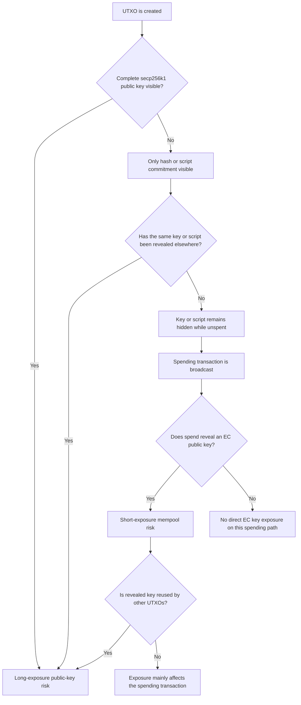

# Bitcoin Address Types and Public-Key Exposure

 Some Bitcoin outputs place an elliptic-curve public key directly on the blockchain when the output is created. Others reveal only a hash or commitment and disclose the public key or spending script later, when the output is spent. Taproot outputs expose a tweaked secp256k1 output key immediately, while hiding optional script paths until one of them is used. These differences are important for post-quantum readiness because a Shor-based attack against Bitcoin’s ECDSA or Schnorr signatures requires an elliptic-curve public key. The time at which that public key becomes available determines the attacker’s possible computation window. A useful high-level distinction is:

- **Long-exposure risk:** a vulnerable public key is visible before the owner begins spending the output, giving an attacker an extended period in which to attempt key recovery.
- **Short-exposure risk:** the public key becomes visible only when a spending transaction is broadcast, requiring an attacker to recover the key and replace the transaction before confirmation.
- **Commitment-only exposure:** the output reveals a public-key hash, script hash or Merkle root, but not the underlying elliptic-curve public keys.
- **Script-dependent exposure:** whether public keys are visible depends on the script committed to by the output and whether that script has previously been revealed.

This chapter classifies the major Bitcoin output types using this model. It examines:

- Pay to Public Key,
- bare multisignature,
- Pay to Public Key Hash,
- Pay to Script Hash,
- Pay to Witness Public Key Hash,
- Pay to Witness Script Hash,
- nested SegWit outputs,
- Pay to Taproot,
- and the draft Pay-to-Merkle-Root proposal.

Exposure depends on the output structure, spending path, key reuse, script reuse, wallet behavior and information revealed outside the blockchain.

## 1. Learning objectives

After reading this chapter, a reader should be able to explain:

1. The difference between a Bitcoin address and an on-chain output script.
2. The difference between a public key and a public-key hash.
3. What information is visible when each major output type is created.
4. What additional information becomes visible when that output is spent.
5. Why P2PK and bare multisignature outputs have immediate public-key exposure.
6. Why fresh P2PKH and P2WPKH outputs delay public-key exposure until spending.
7. Why P2SH and P2WSH exposure depends on the committed script.
8. How key reuse and script reuse change an output’s exposure classification.
9. Why P2TR outputs are exposed to long-exposure quantum key recovery.
10. Why a Taproot script-only policy does not remove the output-key exposure.
11. How draft P2MR outputs differ from P2TR.

## 2. Address, output type, and spending condition

Bitcoin consensus validates transaction outputs and spending witnesses. An output contains:

- an amount,
- and a `scriptPubKey`, sometimes called the output script.

For SegWit outputs, the `scriptPubKey` contains a witness version and witness program. A human-readable address is an encoding used by wallets to communicate enough information to construct that output. The relationship is therefore:

```text
Human-readable address
        ↓ decoded by wallet
Output script or witness program
        ↓ placed in transaction
UTXO created on the blockchain
```

An address may encode:

- a public-key hash,
- a script hash,
- a witness program,
- a Taproot output key,
- or another output commitment.

For exposure analysis, the important objects are:

1. the data written into the output,
2. the data later supplied to spend it,
3. and whether the same keys or scripts appear elsewhere.

Bitcoin transactions create UTXOs whose `scriptPubKey` defines the conditions that a later input must satisfy. BIP173 similarly describes a SegWit address as an encoding of a witness version and witness program, rather than as the consensus object itself.

## 3. What “public-key exposure” means

A public key is considered **exposed** when an observer has enough information to identify the complete secp256k1 point used by a signature condition. Examples include:

- a compressed ECDSA public key,
- an uncompressed ECDSA public key,
- a BIP340 x-only public key,
- a Taproot output key,
- a public key revealed inside a redeem script,
- or a public key revealed inside a witness script or Tapscript leaf.

A public-key hash is not the same as a public key. For example:

\[
h=\operatorname{HASH160}(P)
\]

reveals a 160-bit commitment to \(P\), but does not directly reveal the complete point \(P\). Similarly, a script hash may commit to one or more public keys without revealing them. This distinction matters because the Shor attack requires the elliptic-curve public key as its direct input. A hash-only output therefore delays the direct discrete-log attack until the underlying key becomes known.

## 4. The exposure lifecycle

Public-key exposure should be considered across the full lifecycle of an output.

### 4.1 Output creation

When an output is created, an observer can see:

- its amount,
- its `scriptPubKey`,
- its witness version and witness program, if applicable,
- and any public key, public-key hash, script hash, or output key directly committed in the output.

The first question is:

> Does the output itself reveal a complete secp256k1 public key?

If yes, the output may be a long-exposure target.

### 4.2 Unspent period

While the output remains unspent, additional information may appear elsewhere. Examples include:

- the same public key being used in another transaction,
- the same address being reused,
- the same redeem script being spent elsewhere,
- a wallet descriptor being disclosed,
- an extended public key being shared,
- or a watch-only wallet export being exposed.

An output that initially revealed only a hash may later become linked to a complete public key through reuse or off-chain disclosure.

### 4.3 Transaction broadcast

When the owner spends the output, the transaction enters the peer-to-peer network and may appear in public mempools. The spending input may reveal:

- a full public key,
- a redeem script,
- a witness script,
- a Taproot leaf script,
- an internal key,
- a Merkle path,
- and one or more signatures.

This can create a short-exposure window before confirmation.

### 4.4 Confirmation

After the transaction is confirmed, the spending information remains part of Bitcoin’s public history. The spent output itself can no longer be stolen, but the newly revealed public keys may still matter if:

- the key controls other unspent outputs,
- the address was reused,
- the same script was reused,
- the public key belongs to a wallet derivation structure exposed elsewhere,
- or the key participates in another protocol.

### 4.5 Reuse transforms the exposure model

A hash-committed output may begin as a short-exposure-only target. After one use of the same key or script, other outputs using that key or script may become long-exposure targets. This transition is central:

```text
hash-committed output
        ↓
No complete public key visible

One output using the same key is spent
        ↓
Public key becomes permanently visible

Other unspent outputs using that key
        ↓
Long-exposure targets
```

Bitcoin’s developer documentation recommends avoiding key reuse for privacy and also notes that fresh keys reduce exposure to hypothetical attacks capable of reconstructing private keys from public keys.

## 5. Exposure decision model

The following model can be used when classifying a UTXO.



This model separates two questions:

1. **What does the output type reveal by design?**
2. **What has the wallet revealed through actual use?**

# 6. Pay to Public Key

Pay to Public Key, or P2PK, places a complete public key directly in the output script. A simplified P2PK output is:

```text
<public-key> OP_CHECKSIG
```

The spending input provides:

```text
<signature>
```

P2PK is a simplified public-key output in which the `scriptPubKey` contains the public key and `OP_CHECKSIG`.

## 6.1 Information visible at output creation

Immediately after the output is created, observers can see:

- the complete ECDSA public key,
- the amount,
- and the signature-verification condition.

No public-key hash hides the key.

## 6.2 Information revealed at spending

Spending reveals a signature, but the public key was already visible.

## 6.3 Post-quantum exposure

P2PK is a direct long-exposure target. A future attacker capable of solving the secp256k1 discrete logarithm problem could begin attempting private-key recovery as soon as the output appears. The attacker would not need to wait for:

- transaction broadcast by the owner,
- script revelation,
- address reuse,
- or mempool exposure.

## 6.4 Classification

```text
Creation-time public-key exposure: Yes
Long-exposure risk: Yes
Short-exposure risk: Not the primary distinction, key is already exposed
Reuse sensitivity: Any other output using the same key is also exposed
```

P2PK outputs are particularly relevant to post-quantum analysis because some early Bitcoin outputs of whale accounts used this construction.

# 7. Bare multisignature outputs

A bare multisignature output places multiple public keys directly in the output script. A simplified \(m\)-of-\(n\) script is:

```text
<m> <public-key-1> ... <public-key-n> <n> OP_CHECKMULTISIG
```

The spender supplies enough valid signatures to meet the threshold. Bitcoin’s transaction guide describes bare multisignature scripts as containing the threshold, the public keys and `OP_CHECKMULTISIG`.

## 7.1 Information visible at output creation

Observers can see:

- every public key,
- the threshold \(m\),
- the total number of keys \(n\),
- and the complete spending policy.

## 7.2 Quantum exposure

Every listed elliptic-curve public key is exposed from output creation. A quantum attacker would need to recover enough private keys to satisfy the threshold. For an \(m\)-of-\(n\) policy, the attacker would normally need private keys corresponding to at least \(m\) of the exposed public keys.

## 7.3 Classification

```text
Creation-time public-key exposure: Yes, for all listed keys
Long-exposure risk: Yes
Policy privacy: None
Quantum attacker target: At least threshold number of keys
```

Bare multisignature illustrates that an output may expose not only keys but also the entire authorization policy.

# 8. Pay to Public Key Hash

Pay to Public Key Hash, or P2PKH, places a hash of the public key in the output instead of the complete public key. The output script is:

```text
OP_DUP OP_HASH160 <public-key-hash> OP_EQUALVERIFY OP_CHECKSIG
```

The spending input provides:

```text
<signature> <public-key>
```

During validation, the public key is hashed and compared with the committed public-key hash. The signature is then checked against the authenticated public key.

## 8.1 Information visible at output creation

Before spending, observers see:

- a 20-byte HASH160 value,
- the amount,
- and the standard P2PKH script structure.

The complete public key is not directly present in the output.

## 8.2 Information revealed at spending

The `scriptSig` reveals:

- the complete public key,
- and an ECDSA signature.

Once broadcast, the public key is visible to mempool observers. Once confirmed, it is permanently recorded on-chain.

## 8.3 Fresh-key classification

If the key has never been revealed elsewhere:

```text
Creation-time public-key exposure: No
Long-exposure risk while unspent: No direct ECDLP target
Short-exposure risk during spend: Yes
Post-confirmation key visibility: Yes
```

The owner’s spending transaction creates the first direct opportunity for a Shor-based attack against that key.

## 8.4 Reused-key classification

Suppose the same P2PKH address receives several outputs. After any one of those outputs is spent, the public key becomes visible. All remaining outputs controlled by the same public-key hash can now be associated with the exposed key. Their classification changes to:

```text
Creation-time public-key exposure: Initially no
Public key later revealed through reuse: Yes
Long-exposure risk for remaining UTXOs: Yes
```

## 8.5 HASH160 is not permanent PQ protection

P2PKH delays public-key exposure. After the full public key is revealed, the direct ECDLP threat applies.

# 9. Pay to Script Hash

Pay to Script Hash, or P2SH, commits to the hash of a redeem script. Its output script is:

```text
OP_HASH160 <HASH160(redeemScript)> OP_EQUAL
```

The spender supplies:

- the full redeem script,
- and the stack elements needed to satisfy that script.

BIP16 introduced P2SH to move responsibility for specifying the spending conditions from the sender to the receiver. At output creation, only a fixed-length 20-byte script hash is needed. At spending time, the serialized redeem script is supplied and executed.

## 9.1 Information visible at output creation

Before spending, an observer normally sees:

- the 20-byte redeem-script hash,
- the amount,
- and the fact that the output is P2SH.

The observer does not necessarily know:

- the redeem script,
- the number of keys,
- the public keys,
- the threshold,
- the timelocks,
- or the other spending conditions.

## 9.2 Information revealed at spending

The spending `scriptSig` reveals the full redeem script. If the redeem script contains public keys, those keys become visible. For example, a P2SH multisignature redeem script may reveal:

```text
OP_2
<public-key-A>
<public-key-B>
<public-key-C>
OP_3
OP_CHECKMULTISIG
```

The spend also reveals the signatures or other stack data used to satisfy the script.

## 9.3 Script-dependent classification

P2SH cannot be classified only by its outer output form. Its public-key exposure depends on the redeem script. Possible redeem scripts include:

- single-key signature conditions,
- multisignature policies,
- timelocked conditions,
- hashlocks,
- nested SegWit programs,
- or scripts with no elliptic-curve public key at all.

The correct classification is therefore:

```text
Creation-time public-key exposure: Normally no
Creation-time policy exposure: Normally no
Spend-time public-key exposure: Depends on redeem script
Long-exposure risk: Depends on previous script revelation or reuse
Short-exposure risk: Depends on redeem script
```

## 9.4 Redeem-script reuse

If the same redeem script is used for multiple P2SH outputs, spending one of them reveals the redeem script and all public keys contained in it. Other unspent outputs using the same script hash then become long-exposure targets. This is the script-level equivalent of address or key reuse.

## 9.5 Important qualification

Describing P2SH as resistant to long-exposure attacks assumes that:

- the redeem script remains hidden,
- the same script has not been revealed elsewhere,
- and its embedded public keys have not been exposed through another channel.

The output type protects the script by commitment, but wallet behavior determines whether that protection remains effective.

# 10. Pay to Witness Public Key Hash

Pay to Witness Public Key Hash, or P2WPKH, is a SegWit version 0 output that commits to a 20-byte public-key hash. Its output is:

```text
0 <20-byte-public-key-hash>
```

The witness contains:

```text
<signature> <public-key>
```

BIP141 specifies that a version 0, 20-byte witness program is interpreted as P2WPKH. The witness must contain a signature and public key, and the HASH160 of that public key must match the witness program.

## 10.1 Information visible at output creation

Observers see:

- a version 0 witness program,
- a 20-byte public-key hash,
- and the amount.

The complete public key is not directly visible if it has not been revealed elsewhere.

## 10.2 Information revealed at spending

The witness reveals:

- the complete compressed public key,
- and an ECDSA signature.

The location of the data differs from P2PKH:

```text
P2PKH:
public key and signature in scriptSig

P2WPKH:
public key and signature in witness
```

This difference affects transaction structure, weight, and transaction malleability, but it does not fundamentally change the public-key exposure window.

## 10.3 Quantum classification

For a fresh, unrevealed key:

```text
Creation-time public-key exposure: No
Long-exposure risk while unspent: No direct ECDLP target
Short-exposure risk during spend: Yes
Post-confirmation key visibility: Yes
```

If the same key or address is reused and exposed elsewhere, remaining P2WPKH outputs become long-exposure targets.

## 10.4 Comparison with P2PKH

From the narrow perspective of public-key exposure:

| Property | P2PKH | P2WPKH |
|---|---|---|
| Output commits to | HASH160(public key) | HASH160(public key) |
| Public key visible before spend | No, if fresh | No, if fresh |
| Public key revealed during spend | Yes | Yes |
| Signature location | `scriptSig` | Witness |
| Key reuse changes exposure | Yes | Yes |
| Direct Shor target while fresh and unspent | No | No |

SegWit changes where the key and signature are placed, not whether they must eventually be revealed.

# 11. Pay to Witness Script Hash

Pay to Witness Script Hash, or P2WSH, is a SegWit version 0 output that commits to the SHA-256 hash of a witness script. Its output is:

```text
0 <32-byte-SHA256-witness-script-hash>
```

Its witness contains:

```text
<stack elements...> <witnessScript>
```

BIP141 specifies that the final witness item is the serialized `witnessScript`. Its SHA-256 hash must match the 32-byte witness program, after which the script is executed using the remaining witness stack.

## 11.1 Information visible at output creation

Observers see:

- a version 0 witness program,
- a 32-byte SHA-256 script commitment,
- and the amount.

The witness script and its public keys are not directly visible.

## 11.2 Information revealed at spending

The witness reveals:

- the complete witness script,
- signatures,
- public data needed by the script,
- and possibly public keys embedded in the script.

## 11.3 Quantum classification

Like P2SH, P2WSH is script-dependent:

```text
Creation-time public-key exposure: Normally no
Creation-time policy exposure: Normally no
Spend-time public-key exposure: Depends on witness script
Long-exposure risk: Depends on previous script/key revelation
Short-exposure risk: Depends on witness script
```

## 11.4 Script reuse

If the same witness script is used for several P2WSH outputs, spending one reveals the script. Any remaining outputs using the same witness-script hash can then be analyzed using the revealed script and its embedded keys.

## 11.5 P2WSH versus P2SH

Both commit to scripts, but they use different commitments:

```text
P2SH:
HASH160(redeemScript) — 20 bytes

P2WSH:
SHA256(witnessScript) — 32 bytes
```

BIP141 explicitly notes that P2WSH’s 32-byte script hash provides a greater security margin against collision attacks than P2SH’s 20-byte commitment. For public-key exposure, however, the main similarity is that both can hide script-contained public keys until the committed script is revealed.

# 12. Nested SegWit outputs

SegWit witness programs can also be wrapped inside P2SH. The common forms are:

- P2SH-P2WPKH,
- P2SH-P2WSH.

These were useful during the transition to native SegWit because they could be sent to using P2SH-compatible wallet infrastructure.

## 12.1 P2SH-P2WPKH

The outer output is:

```text
OP_HASH160 <HASH160(redeemScript)> OP_EQUAL
```

The redeem script is a P2WPKH witness program:

```text
0 <20-byte-public-key-hash>
```

When spent:

- the `scriptSig` reveals the witness program,
- the witness reveals the signature and complete public key.

BIP141 specifies this nested form and shows that the public key and signature are ultimately verified using the same P2WPKH rules.

### Exposure model

Before spending, an observer sees only the outer P2SH script hash. At spending time, the observer learns:

1. that the output wraps P2WPKH,
2. the inner public-key hash,
3. the complete public key,
4. and the signature.

```text
Creation-time public-key exposure: No
Creation-time inner type exposure: No
Spend-time public-key exposure: Yes
Short-exposure risk: Yes
Reuse sensitivity: Yes
```

## 12.2 P2SH-P2WSH

The outer output is P2SH. The redeem script contains:

```text
0 <32-byte-witness-script-hash>
```

When spent:

- the `scriptSig` reveals the P2WSH witness program,
- the witness reveals the witness script and its satisfaction data.

BIP141 specifies that the revealed witness script is then executed under P2WSH rules.

### Exposure model

```text
Creation-time public-key exposure: No
Creation-time script-policy exposure: No
Spend-time public-key exposure: Depends on witness script
Long-exposure risk after reuse: Depends on script/key reuse
```

## 12.3 Exposure layering

Nested outputs illustrate that exposure may occur in stages:

```text
Before spend:
outer P2SH hash only

During spend:
inner witness program revealed

During witness evaluation:
public key or witness script revealed
```

# 13. Pay to Taproot

Pay to Taproot, or P2TR, is a SegWit version 1 output. A P2TR output commits directly to a 32-byte x-only secp256k1 output key:

```text
1 <32-byte-output-key>
```

BIP341 states that the public key is directly included in the output, unlike earlier constructions that typically store a hash of a public key or script. A Taproot output can be spent using either a key path or, optionally, a script path.

## 13.1 Internal key, script tree and output key

Conceptually, Taproot combines:

- an internal public key \(P\),
- and an optional Merkle root \(m\) committing to script leaves.

The output key is derived as:

\[
Q=P+H_{\text{TapTweak}}(P\parallel m)G.
\]

The blockchain output contains the x-coordinate of \(Q\). The output does not directly reveal:

- \(P\),
- the script-tree root,
- the number of scripts,
- or the scripts themselves.

But it does reveal the complete x-only elliptic-curve output key \(Q\).

## 13.2 Key-path spending

A key-path spend normally reveals:

- a BIP340 Schnorr signature,
- and possibly a sighash byte.

The public key needed to verify that signature was already available in the output. BIP341 defines key-path validation using the Taproot output key and a 64- or 65-byte signature.

### Exposure model

```text
Creation-time public-key exposure: Yes — Taproot output key
Spend-time additional key exposure: Normally no
Long-exposure risk: Yes
Signature scheme: secp256k1 Schnorr
```

## 13.3 Script-path spending

A script-path spend reveals:

- the executed leaf script,
- stack elements satisfying that script,
- a control block,
- the internal key,
- and the Merkle path required to reconstruct the output commitment.

Unused script branches remain hidden. BIP341 specifies that the control block contains the internal key and the hashes required to reconstruct the Taproot output key; only the selected script leaf and its path are disclosed.

### Exposure model

Before spending:

- the Taproot output key is visible,
- optional scripts remain hidden.

During script-path spending:

- the selected script is revealed,
- script-contained public keys may become visible,
- the internal key is revealed through the control block,
- unused script leaves remain hidden.

## 13.4 Why P2TR has long-exposure quantum risk

The Taproot output key \(Q\) is a valid secp256k1 public key exposed when the output is created. A sufficiently capable quantum attacker could attempt to recover the scalar \(q\) such that:

\[
Q=qG.
\]

After recovering \(q\), the attacker could create a valid key-path Schnorr signature. This remains true even if the wallet’s intended policy is to spend only through a script path. BIP341 describes how a wallet can choose a NUMS internal key so that no participant knows a conventional key-path private key. Classically, this can make key-path spending unavailable to the intended parties. However, the resulting output key is still an elliptic-curve point. A quantum attacker capable of solving ECDLP could recover its discrete logarithm and use the key path. BIP360 is motivated by removing precisely this quantum-vulnerable key-path structure.

## 13.5 Taproot script privacy versus quantum exposure

Taproot provides meaningful script privacy:

- the full script policy is not revealed at output creation,
- key-path spending reveals no script tree,
- script-path spending reveals only the selected leaf and Merkle path.

These privacy properties do not remove the quantum exposure of the output key. It is therefore useful to separate:

```text
Script privacy:
How much of the spending policy is revealed?

Public-key exposure:
Is a quantum-vulnerable EC key visible?

Post-quantum authorization:
Can the output be spent without relying on vulnerable EC signatures?
```

Taproot improves the first property but does not solve the third.

# 14. Draft Pay-to-Merkle-Root

BIP360 proposes Pay-to-Merkle-Root, or P2MR, as a new SegWit version 2 output type. As of this chapter’s drafting, BIP360 is a **draft proposal**, not a deployed Bitcoin consensus rule. It proposes an output that commits directly to a script-tree Merkle root and removes Taproot’s key-path spend. A proposed P2MR output is:

```text
OP_2 OP_PUSHBYTES_32 <script-tree-Merkle-root>
```

## 14.1 Information visible at output creation

The output reveals:

- a 32-byte script-tree Merkle root,
- the witness version,
- and the amount.

It does not include:

- an internal secp256k1 key,
- a tweaked output key,
- or a key-path spending condition.

## 14.2 Information revealed at spending

A P2MR spend would reveal:

- the chosen leaf script,
- the stack elements needed to satisfy it,
- and the Merkle path proving that the leaf belongs to the committed tree.

Unlike P2TR, the control block does not need to reveal an internal key because P2MR has no internal key or key-path spend.

## 14.3 Exposure depends on the leaf script

P2MR does not automatically make every spending path post-quantum secure. A leaf script could contain:

- an ECDSA or Schnorr public key,
- a public-key hash,
- a hashlock,
- a timelock,
- a future post-quantum signature opcode,
- or a combination of conditions.

If a P2MR leaf uses a current elliptic-curve signature:

- the key may remain hidden until the leaf is spent,
- the spend may create short-exposure risk,
- and reuse of the same leaf or key may create long-exposure risk afterward.

## 14.4 What P2MR aims to achieve

BIP360 describes P2MR as a script-tree output intended to resist long-exposure attacks by removing P2TR’s key path. It also describes P2MR as a possible foundation for later post-quantum signature integration. The BIP explicitly notes that short-exposure attacks may still require post-quantum signatures.

## 14.5 Classification

```text
Status: Draft proposal
Creation-time EC public-key exposure: No, at output level
Key path: None
Script privacy: Hides unspent script leaves
Spend-time key exposure: Depends on selected leaf
Long-exposure resistance: Yes, if committed scripts and keys remain hidden
Short-exposure protection: Not guaranteed
Fully post-quantum by itself: No
```

# 15. External and off-chain public-key exposure

Blockchain analysis alone may not reveal the complete exposure state of a wallet. A public key can also be exposed through:

- extended public keys,
- wallet descriptors,
- watch-only wallet exports,
- partially signed Bitcoin transactions,
- public backup material,
- reused keys in another protocol,
- published proofs or signed messages,
- application logs,
- compromised wallet servers,
- and collaborative signing transcripts.

BIP360 explicitly notes that extended public keys and wallet descriptors reveal quantum-vulnerable public-key information.

## 15.1 Extended public keys

An extended public key, or xpub, allows derivation of a sequence of non-hardened child public keys. Publishing an xpub may therefore expose much more than one Bitcoin public key. A quantum-readiness inventory should not classify outputs only by their on-chain appearance if the corresponding public keys are known through an xpub.

## 15.2 Wallet descriptors

Descriptors can contain:

- raw public keys,
- extended public keys,
- scripts,
- key origins,
- derivation paths,
- and output templates.

Descriptors are useful for wallet interoperability and backups, but should be treated as sensitive wallet metadata.

## 15.3 Application-layer reuse

The same secp256k1 key may be used outside the specific UTXO being examined. If it has been published or used in another protocol, a hash-committed Bitcoin output may already be indirectly exposed. This is why a UTXO classifier may need two layers:

```text
On-chain exposure classification
and
Known wallet-level exposure classification
```

# 16. Summary exposure matrix

The following table summarizes the main output forms.

| Output form | Data visible before spend | Complete EC public key visible before spend? | Data revealed at spend | Long-exposure classification | Short-exposure classification |
|---|---|---:|---|---|---|
| P2PK | Public key | Yes | Signature | Exposed | Already exposed |
| Bare multisig | All public keys and threshold | Yes | Required signatures | Exposed | Already exposed |
| Fresh P2PKH | HASH160 of public key | No | Public key and signature | Not directly exposed while fresh | Exposed during spend |
| Reused P2PKH | HASH160, with key known elsewhere | Yes indirectly | Public key and signature | Exposed | Exposed during spend |
| P2SH | HASH160 of redeem script | Normally no | Redeem script and satisfaction data | Depends on script reuse/revelation | Depends on script |
| Fresh P2WPKH | HASH160 of public key | No | Public key and signature in witness | Not directly exposed while fresh | Exposed during spend |
| Reused P2WPKH | HASH160, with key known elsewhere | Yes indirectly | Public key and signature | Exposed | Exposed during spend |
| P2WSH | SHA-256 of witness script | Normally no | Witness script and satisfaction data | Depends on script reuse/revelation | Depends on script |
| P2SH-P2WPKH | HASH160 of nested witness program | No | Witness program, public key, signature | Not directly exposed while fresh | Exposed during spend |
| P2SH-P2WSH | HASH160 of nested witness program | No | Witness program, witness script, satisfaction data | Depends on reuse/revelation | Depends on script |
| P2TR key path | Tweaked x-only output key | Yes | Schnorr signature | Exposed | Already exposed |
| P2TR script path | Tweaked x-only output key | Yes | Leaf script, internal key, Merkle path, satisfaction data | Exposed through output key | Additional script keys may be exposed |
| Draft P2MR | Script-tree Merkle root | No output-level EC key | Leaf script, Merkle path, satisfaction data | Designed to resist long exposure | Depends on leaf/signature scheme |

# 17. Wallet-readiness implications

The exposure analysis suggests several wallet-readiness practices.

## 17.1 Avoid key and address reuse

Reusing a public key or address can transform a hash-committed UTXO from a short-exposure target into a long-exposure target. This recommendation already aligns with established Bitcoin privacy and security practice.

## 17.2 Avoid unnecessary script reuse

Reusing identical redeem scripts or witness scripts means one spend can reveal the policy and keys protecting other outputs. Wallets should consider generating fresh scripts or keys where practical.

## 17.3 Inventory actual exposure, not only nominal output types

A wallet should not classify every P2PKH output as “key hidden” without checking whether:

- the address was previously spent from,
- the public key appeared in another transaction,
- the xpub was exposed,
- or the same key appears in another script.

## 17.4 Treat xpubs and descriptors as sensitive

They may reveal enough public information to change the quantum-exposure classification of many outputs.

## 17.5 Distinguish privacy from post-quantum security

An output can have good script privacy while exposing a quantum-vulnerable output key. P2TR is the clearest example.

## 17.6 Record the spending path

For script-based outputs, exposure depends on which path is used. A useful wallet inventory may record:

- output type,
- script policy,
- key-reuse state,
- whether the script was previously revealed,
- and intended spending path.

# 18. Summary

Bitcoin output types reveal cryptographic information at different stages. P2PK and bare multisignature outputs expose their public keys immediately. Fresh P2PKH and P2WPKH outputs reveal public-key hashes and delay complete public-key exposure until spending. P2SH and P2WSH outputs hide their scripts until spending, so their exposure depends on:

- script contents,
- script reuse,
- and whether embedded keys were disclosed elsewhere.

Nested SegWit outputs add another commitment layer but eventually reveal the inner witness program and corresponding key or script. P2TR outputs expose a tweaked x-only secp256k1 output key from creation. Taproot may hide optional script branches, but it does not hide the output key. This creates long-exposure quantum risk even when the intended wallet policy primarily uses script paths. 

Draft P2MR removes the key-path structure and commits directly to a script-tree root. It is designed to reduce long-exposure risk, but its actual spending security depends on the leaf scripts and signature mechanisms used.

A complete exposure analysis must ask:

1. What is visible when the output is created?
2. What is revealed when it is spent?
3. Has the same key or script already been exposed?
4. Is relevant public information available off-chain?
5. Which signature scheme ultimately authorizes spending?

# 19. Further reading

Primary specifications:

- BIP16: Pay to Script Hash.
- BIP141: Segregated Witness.
- BIP173: Native SegWit address encoding.
- BIP340: Schnorr Signatures for secp256k1.
- BIP341: Taproot spending rules.
- BIP342: Tapscript validation rules.
- BIP360: Pay-to-Merkle-Root, currently draft.
