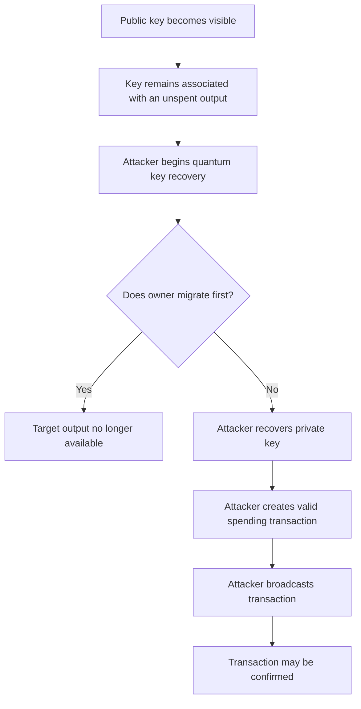
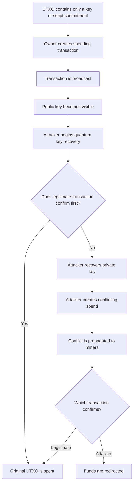

# Long-Exposure versus Short-Exposure Quantum Attacks

A quantum attack against Bitcoin’s ECDSA or Schnorr signatures requires access to an elliptic-curve public key. However, Bitcoin does not reveal every public key at the same stage of an output’s lifecycle. Some public keys are visible from the moment an output is created. Others remain hidden behind a hash or script commitment until the owner broadcasts a spending transaction. This difference determines how much time a quantum attacker has to recover the corresponding private key.

Two attack categories are therefore especially useful for Bitcoin post-quantum analysis:

- **Long-exposure attacks:** the attacker can observe a vulnerable public key for an extended period before the legitimate owner moves the coins.
- **Short-exposure attacks:** the public key becomes available only when the legitimate spending transaction is broadcast, requiring the attacker to recover the key and win a transaction race before confirmation.

Recent quantum-resource literature uses closely related terminology:

- **at-rest attacks** for long-exposed keys,
- **on-spend attacks** for keys revealed by transactions in transit,
- **long-range** for long-exposure attacks,
- and **short-range** or **just-in-time** for short-exposure attacks.

These terms describe the attacker’s available computation window. In both cases, the attacker may use Shor’s algorithm to solve the elliptic-curve discrete logarithm problem and recover a private key. The difference is how long the attacker has to complete the computation and successfully use the recovered key.

## 1. Learning objectives

After reading this chapter, a reader should be able to explain:

1. What long-exposure and short-exposure attacks mean.
2. How these terms relate to at-rest and on-spend attacks.
3. Why both attacks require access to an elliptic-curve public key.
4. Which Bitcoin output types are exposed from creation.
5. Which output types reveal public keys only during spending.
6. How address, key, script, and descriptor reuse change the exposure model.
7. Why the short-exposure window is not always exactly ten minutes.
8. How a quantum attacker could construct a conflicting transaction.
9. Why transaction-relay policy and consensus validity are different.
10. Why confirmation of one transaction does not necessarily remove risk to other outputs using the same key.
11. How Taproot and P2MR differ under this attack model.
12. Why reducing long-exposure risk does not provide complete post-quantum security.
13. Which mitigations address long exposure, short exposure, or both.

## 2. Core definitions

### 2.1 Long-exposure attack

A **long-exposure attack** targets an elliptic-curve public key that remains available to an attacker for a relatively long period. The exposure may last hours, days, months, years, or indefinitely. Examples include:

- a public key directly contained in a P2PK output,
- public keys in a bare multisignature output,
- a Taproot output key,
- a public key revealed by an earlier transaction and reused by another UTXO,
- a public key contained in a previously revealed redeem script or witness script,
- or public keys disclosed through an extended public key or wallet descriptor.

BIP360 describes long-exposure attacks as the likely first class of practical quantum attacks on Bitcoin because the attacker has as much time as the vulnerable key remains exposed. The attack succeeds if the attacker can recover and use the private key before the legitimate owner removes or otherwise protects the vulnerable funds. A simplified condition is:

\[
T_{\mathrm{recover}} + T_{\mathrm{spend}}
<
T_{\mathrm{remaining\ exposure}}
\]

where:

- \(T_{\mathrm{recover}}\) is the time needed to recover the private key,
- \(T_{\mathrm{spend}}\) is the time needed to construct, propagate, and confirm an attacker transaction,
- and \(T_{\mathrm{remaining\ exposure}}\) is the time before the owner migrates or spends the output.

### 2.2 Short-exposure attack

A **short-exposure attack** targets a public key that becomes visible only when the owner attempts to spend an output. A typical example is a fresh P2PKH or P2WPKH output:

1. Before spending, the blockchain contains only a public-key hash.
2. The owner broadcasts a spending transaction.
3. The transaction reveals the complete public key.
4. The attacker attempts to recover the private key.
5. The attacker constructs a conflicting spend.
6. The attacker attempts to have the conflicting transaction confirmed first.

The attack must be completed during the relatively short period in which the legitimate transaction is unconfirmed. A simplified success condition is:

\[
T_{\mathrm{observe}}
+
T_{\mathrm{recover}}
+
T_{\mathrm{construct}}
+
T_{\mathrm{propagate}}
<
T_{\mathrm{legitimate\ confirmation}}
\]

where:

- \(T_{\mathrm{observe}}\) is the delay before the attacker learns the public key,
- \(T_{\mathrm{recover}}\) is the quantum key-recovery time,
- \(T_{\mathrm{construct}}\) is the time to create and sign a conflict,
- \(T_{\mathrm{propagate}}\) is the time to deliver it to miners,
- and \(T_{\mathrm{legitimate\ confirmation}}\) is the time until the original spend is confirmed.

The recent Google Quantum AI–associated analysis calls this an **on-spend attack** and defines it as deriving the private key during the settlement window after a transaction has been broadcast. It uses roughly ten minutes as Bitcoin’s average block-time reference, while also distinguishing architectures fast enough for on-spend attacks from slower architectures that may initially threaten only long-exposed keys.

## 3. The distinction is about time, not cryptographic strength

Long-exposure and short-exposure attacks do not use different mathematical weaknesses. Both target the same public-key relation:

\[
P=dG
\]

where:

- \(d\) is the private key,
- \(G\) is the secp256k1 generator,
- and \(P\) is the public key.

Both assume that a cryptographically relevant quantum computer can solve for \(d\) from \(P\). The difference is operational:

```text
Long exposure:
Attacker has a long time to recover d.

Short exposure:
Attacker must recover d and act before confirmation.
```

This means an output may be secure against one class of early quantum attacker but vulnerable to another, faster one. For example:

- A slow but sufficiently large quantum computer may be able to recover keys exposed for years.
- The same machine may be unable to recover a key during a mempool interval.
- A later fast-clock machine may be able to complete key recovery within minutes and attempt on-spend attacks.

The quantum-resource paper associates this distinction with hardware architecture. It argues that slower architectures may initially be limited to at-rest attacks, while sufficiently fast superconducting, photonic, or silicon architectures could potentially support on-spend attacks under its stated assumptions.

## 4. Threat-model assumptions

The analysis in this chapter assumes that the attacker can:

1. Observe relevant public keys on-chain, off-chain, or in pending transactions.
2. Operate or access a sufficiently capable fault-tolerant quantum computer.
3. Use Shor’s algorithm to recover a secp256k1 private key.
4. Verify the recovered key classically.
5. Construct an otherwise valid Bitcoin transaction.
6. Produce an ordinary ECDSA or Schnorr signature using the recovered key.
7. Send the transaction to peers, miners, or another transaction-relay path.
8. Pay an appropriate transaction fee.

The attacker does **not** need to:

- make Bitcoin nodes accept invalid signatures,
- alter Bitcoin Core,
- break SHA-256,
- guess the wallet seed directly,
- modify past blocks,
- or convince the network to change consensus rules.

Once the private key is recovered, the attacker can produce a signature that is valid under Bitcoin’s existing rules. The nodes cannot determine whether the signature came from:

- the original owner,
- a wallet backup,
- a stolen seed,
- or a quantum-recovered private key.

## 5. The exposure lifecycle

The attack category of a UTXO may change over time.

### 5.1 Output creation

At output creation, the blockchain may reveal:

- a complete public key,
- a public-key hash,
- a script hash,
- a witness program,
- a Taproot output key,
- or a script-tree root.

If a complete elliptic-curve public key is visible immediately, the output enters a long-exposure state.

### 5.2 Unspent period

While the output remains unspent, additional information may appear through:

- another transaction using the same key,
- another output using the same script,
- publication of an xpub,
- disclosure of a wallet descriptor,
- a signed message,
- a watch-only wallet export,
- a collaborative-signing transcript,
- or a compromised service.

A hash-committed output can therefore become a long-exposure target without being spent itself.

### 5.3 Spending transaction broadcast

When the owner broadcasts a spending transaction, the transaction may reveal:

- a public key,
- a redeem script,
- a witness script,
- a Taproot leaf,
- an internal key,
- or a combination of these.

Bitcoin’s transaction documentation shows that a P2PKH spending input contains the full public key and signature and is broadcast across the peer-to-peer network for independent validation. This broadcast may create a short-exposure window.

### 5.4 Confirmation

Once the legitimate transaction confirms, the original UTXO has been spent. For a pure on-spend key-recovery attack, the attacker’s opportunity to steal that particular UTXO usually ends when the legitimate spend is confirmed, unless the attacker also has enough mining capability to reorganize the chain. However, the now-revealed public key may continue to threaten:

- other UTXOs using the same key,
- other scripts containing the key,
- related wallet structures,
- or funds received later to a reused address.

The key may therefore transition from:

```text
short-exposure target
```

to:

```text
long-exposure target for other funds
```

### 5.5 Unconfirmed or replaced transactions

A public key can become exposed even if the transaction that revealed it never confirms. Once a spending transaction has been shared with:

- peers,
- miners,
- explorers,
- mempool services,
- or an adversarial observer,

the public key should be treated as exposed. Removing the transaction from a mempool does not make the key secret again.

## 6. Long-exposure attack flow

A long-exposure attack can be represented as follows:



The attacker may choose not to spend immediately after recovering the key. A patient attacker could:

- recover keys quietly,
- accumulate a database of recovered private keys,
- target selected outputs later,
- wait for favourable fees,
- or avoid revealing quantum capability until strategically useful.

BIP361’s authors explicitly raise the possibility that a quantum attacker could derive private keys and delay moving funds, making the beginning of an attack difficult to detect.

## 7. Outputs commonly associated with long exposure

### 7.1 P2PK

A P2PK output contains a complete public key in its locking script. The attacker can begin key recovery as soon as the output is visible.

```text
Exposure state: Long exposure from creation
```

### 7.2 Bare multisignature

Bare multisignature outputs contain all participating public keys. A quantum attacker must normally recover enough private keys to satisfy the threshold. For an \(m\)-of-\(n\) output:

```text
Required recovered keys: usually at least m
Exposure state: Long exposure from creation
```

### 7.3 P2TR

A P2TR output contains a complete x-only secp256k1 output key. This key is visible from output creation, regardless of whether the owner plans to use:

- key-path spending,
- or script-path spending.

A quantum attacker that recovers the discrete logarithm of the Taproot output key can create a key-path Schnorr signature.

```text
Exposure state: Long exposure from creation
```

### 7.4 Reused P2PKH and P2WPKH keys

Fresh P2PKH and P2WPKH outputs contain a public-key hash rather than a complete public key. However, after the same key is revealed through any spend, all remaining outputs using that key become long-exposure targets.

```text
Initial state: Hidden until spend
After key reuse: Long exposure
```

### 7.5 Reused P2SH and P2WSH scripts

P2SH and P2WSH initially reveal script commitments. When a spend reveals the committed script, public keys contained in that script become visible. If other UTXOs use the same script or keys, those outputs may become long-exposure targets.

### 7.6 Extended public keys and descriptors

An extended public key can allow derivation of many non-hardened child public keys. A wallet descriptor may contain:

- public keys,
- xpubs,
- derivation paths,
- scripts,
- and output templates.

BIP360 notes that xpubs and wallet descriptors reveal quantum-vulnerable public-key information. This means an on-chain public-key hash should not automatically be classified as hidden if the corresponding public key can already be derived from publicly disclosed wallet metadata.

## 8. Short-exposure attack flow

A short-exposure attack can be represented as follows:



This attack requires both cryptographic speed and transaction-delivery capability. The attacker must:

- see the public key early,
- recover the private key,
- create a valid conflict,
- offer an attractive fee or delivery path,
- and reach miners before the original transaction confirms.

## 9. The short-exposure window is not exactly ten minutes

Bitcoin is often described as producing a block approximately every ten minutes on average. That does not mean every pending transaction has exactly ten minutes of exposure. A transaction may confirm:

- almost immediately after broadcast,
- after several minutes,
- after several blocks,
- or much later if its fee is insufficient.

The effective short-exposure window depends on:

- when during the block interval the transaction is broadcast,
- its feerate,
- current mempool conditions,
- miner transaction selection,
- network propagation,
- whether the transaction has unconfirmed ancestors,
- and whether it is delayed or rejected by policy.

The relevant window is therefore:

```text
time from attacker observation
until the legitimate spend becomes sufficiently final
```

rather than a fixed protocol constant.

## 10. Constructing a conflicting transaction

After recovering the private key, the attacker can create another transaction spending the same UTXO. The competing transaction may:

- pay the funds to an attacker-controlled output,
- use a higher feerate,
- remove or alter the original recipient outputs,
- and include a valid signature under the recovered key.

Only one conflicting spend can ultimately be included in the accepted chain.

### 10.1 Relay policy versus consensus rules

Whether peers relay a replacement is partly a policy question. BIP125 defines opt-in Replace-by-Fee behaviour. Under that policy, nodes may replace an unconfirmed transaction that signals replaceability if the replacement meets specified fee and dependency conditions. However:

- mempool acceptance is not the same as consensus validity,
- different nodes and miners may use different relay policies,
- and an attacker’s transaction still needs to reach miners.

A short-exposure attacker cannot assume that a higher-fee conflict will automatically propagate or confirm. The outcome depends on transaction policy, network topology, miner connectivity, fee incentives and timing.

### 10.2 RBF signalling does not create the cryptographic vulnerability

The vulnerability arises because the attacker has recovered the private key. Replace-by-Fee may affect propagation of the conflicting transaction, but it is not the source of the attack. Even without opt-in replacement signalling, the attacker may attempt to deliver a valid conflicting transaction through alternative routes. Whether it is accepted or mined is an operational question rather than a signature-validity question.

## 11. Outputs commonly associated with short exposure

### 11.1 Fresh P2PKH

Before spending:

```text
Visible:
HASH160(public key)

Hidden:
complete public key
```

During spending:

```text
Revealed:
public key
ECDSA signature
```

If the public key was not previously known, the owner’s spend creates a short-exposure window.

### 11.2 Fresh P2WPKH

P2WPKH has a similar key-exposure model. Before spending, the witness program contains a public-key hash. During spending, the witness reveals:

- the complete public key,
- and an ECDSA signature.

SegWit changes where the data is placed, not when the public key becomes available.

### 11.3 P2SH

A P2SH output initially reveals a redeem-script hash. During spending, the redeem script becomes visible. If the script contains ECDSA or Schnorr public keys, those keys may become short-exposure targets. The classification depends on:

- the script,
- whether the script was previously revealed,
- and whether the keys appear elsewhere.

### 11.4 P2WSH

P2WSH initially reveals a SHA-256 commitment to a witness script. At spending time, the witness script and satisfaction data are revealed. Any public keys contained in that script may then become short-exposure targets.

### 11.5 Draft P2MR with elliptic-curve leaves

P2MR proposes committing to a script-tree root without a Taproot key path. If a selected P2MR leaf contains a current secp256k1 signature condition, its public key may remain hidden until the leaf is spent. When the transaction is broadcast, the leaf and public key become visible, creating a short-exposure window. BIP360 explicitly states that P2MR is designed to resist long-exposure attacks but does not by itself protect against short-exposure attacks. Full short-exposure protection may require post-quantum signatures.

## 12. Output-type comparison

| Output type | Public key visible before spend? | Typical initial category | Can reuse create long exposure? | Short exposure during spend? |
|---|---:|---|---:|---:|
| P2PK | Yes | Long exposure | Already exposed | Not the main distinction |
| Bare multisig | Yes | Long exposure | Already exposed | Not the main distinction |
| Fresh P2PKH | No | Hidden until spend | Yes | Yes |
| Reused P2PKH | Yes, through prior reveal | Long exposure | Already transformed | Yes |
| Fresh P2WPKH | No | Hidden until spend | Yes | Yes |
| Reused P2WPKH | Yes, through prior reveal | Long exposure | Already transformed | Yes |
| P2SH | Usually not at outer layer | Script-dependent | Yes | Depends on script |
| P2WSH | Usually not at outer layer | Script-dependent | Yes | Depends on script |
| P2TR | Yes, output key | Long exposure | Already exposed | Key was already available |
| Draft P2MR | No output-level EC key | Script-dependent hidden state | Yes | Depends on selected leaf |

This table classifies exposure to elliptic-curve key recovery. Other relevant factors include:

- hash-preimage strength,
- wallet compromise,
- threshold policy,
- signature type,
- script correctness,
- backup security,
- and implementation quality.

## 13. How short exposure becomes long exposure

A UTXO may begin in a short-exposure state and later transition into a long-exposure state.

### 13.1 Address reuse

Suppose a wallet receives three payments to the same P2WPKH address. Before any spend:

```text
All outputs reveal only the same public-key hash.
```

When one output is spent:

```text
The complete public key is revealed.
```

The other two unspent outputs now use a known public key and become long-exposure targets.

### 13.2 Script reuse

Suppose several P2WSH outputs use the same multisignature witness script. Spending one output reveals:

- the full script,
- its threshold,
- and its public keys.

The remaining outputs now have exposed keys and policy structure.

### 13.3 Broadcast without confirmation

Suppose a P2PKH transaction is broadcast but later:

- dropped,
- replaced,
- abandoned,
- or never confirmed.

The public key was still revealed to observers. Any other UTXO using that key should now be classified as long exposure.

### 13.4 Xpub disclosure

Suppose a wallet uses fresh addresses correctly but its xpub becomes public. An observer may derive the corresponding non-hardened child public keys. The outputs may appear hash-protected on-chain while their keys are already known off-chain.

### 13.5 Descriptor disclosure

A descriptor may reveal:

- derivation information,
- public keys,
- scripts,
- and wallet policy.

The exposure classifier should therefore distinguish:

```text
On-chain hidden
```

from:

```text
Known hidden-key material through external data
```

## 14. Taproot under the two attack models

Taproot requires special treatment because script privacy and public-key exposure are different properties.

### 14.1 Taproot output key

Every P2TR output contains a complete x-only secp256k1 output key. This makes P2TR a long-exposure target from output creation. The attacker does not need to wait for:

- a key-path spend,
- a script-path spend,
- the internal key,
- or a script leaf.

### 14.2 Key-path spending

A key-path spend reveals a Schnorr signature, but the relevant public key was already visible. The output’s exposure category does not change from short to long at spend time. It was long exposure from creation.

### 14.3 Script-path spending

A script-path spend additionally reveals:

- the selected Tapscript leaf,
- the internal key,
- the control block,
- and the Merkle path.

Public keys contained inside the selected leaf may become newly exposed. This can matter if those keys protect other outputs. However, the Taproot output key itself was already exposed.

### 14.4 NUMS internal keys

A wallet may use a NUMS-style internal key so that ordinary participants do not know a usable key-path private key. This may make key-path spending classically unavailable to those participants. It does not remove the quantum exposure of the final Taproot output key. A quantum attacker capable of solving ECDLP can recover the scalar corresponding to that output key and create a valid key-path spend.

## 15. P2MR under the two attack models

BIP360’s proposed P2MR output commits directly to a script-tree root and omits the Taproot internal key and key-path spend. This changes the exposure model.

### Before spending

The output contains:

- a Merkle root,
- not an elliptic-curve output key.

Therefore, the output does not create the same immediate ECDLP target as P2TR.

### During spending

The selected leaf script becomes visible. If that leaf contains:

- a Schnorr public key,
- an ECDSA public key,
- or another elliptic-curve verification condition,

then a short-exposure window may arise.

### With a future PQ signature leaf

If the leaf uses a secure post-quantum signature scheme, the spend may avoid exposing a quantum-vulnerable elliptic-curve public key. This is why P2MR can be viewed as migration infrastructure rather than a complete post-quantum signature solution.

## 16. Multisignature and threshold policies

### 16.1 Script-based multisignature

For an \(m\)-of-\(n\) script, an attacker normally needs enough recovered private keys to meet the threshold. If all public keys are exposed:

```text
Long-exposure attack:
recover at least m keys before the owner moves the funds.
```

If the script is hidden behind P2SH or P2WSH:

```text
Short-exposure attack:
recover at least m keys after the script is revealed.
```

The short-exposure difficulty grows because multiple quantum key-recovery computations may be needed. However, the attacker may parallelize across multiple quantum systems or target policies with a low threshold.

### 16.2 Aggregated Schnorr keys

A MuSig-style aggregate key appears as one secp256k1 public key. A quantum attacker need not necessarily recover each participant’s original key share. If the attacker solves the discrete logarithm of the aggregate public key, the attacker obtains the aggregate signing scalar needed to produce a valid signature for that aggregate key. This means on-chain key aggregation improves privacy and classical efficiency but does not eliminate the quantum discrete-log threat.

### 16.3 Threshold signatures

A threshold signature may also appear on-chain as one public key and one signature. Its post-quantum exposure is determined by the on-chain public key and signature scheme, not only by how the secret was distributed internally.

## 17. Slow-clock and fast-clock threat stages

The two exposure categories suggest a possible progression of quantum capability.

### Stage 1: No practical ECDLP attack

Quantum computers cannot recover secp256k1 private keys at useful scale. Current Bitcoin outputs remain protected by their existing signature assumptions.

### Stage 2: Long-exposure attacks become practical

A quantum computer can recover keys given substantial time. Likely targets include:

- P2PK outputs,
- P2TR outputs,
- bare multisignature,
- reused keys,
- dormant exposed outputs,
- and disclosed xpub-derived keys.

Fresh hash-committed outputs may remain protected against direct ECDLP attack until spending.

### Stage 3: Short-exposure attacks become practical

A faster quantum computer can recover a key during a pending transaction’s settlement window. Fresh P2PKH, P2WPKH, hidden script paths and classical P2MR leaves may become vulnerable during spending. The cited quantum-resource paper maps this distinction to slow-clock and fast-clock architectures, while emphasizing that actual feasibility depends on large-scale fault-tolerant hardware and the paper’s architectural assumptions.

### Stage 4: Ecosystem-wide migration becomes unavoidable

Once short-exposure attacks are practical, reducing public-key exposure alone is insufficient. Secure spending requires:

- post-quantum signatures,
- a secure migration path,
- or another authorization mechanism not dependent on exposed elliptic-curve keys.

## 18. Factors affecting long-exposure attacks

The success of a long-exposure attack depends on:

### 18.1 Remaining lifetime of the output

A dormant output may remain available for years. An actively managed wallet may migrate quickly once a threat is credible.

### 18.2 Key reuse

One recovered key may unlock multiple UTXOs.

### 18.3 Target value

An attacker may prioritize high-value outputs.

### 18.4 Public-key availability

The attacker may use:

- blockchain data,
- xpubs,
- descriptors,
- leaked wallet databases,
- or other off-chain sources.

### 18.5 Quantum-computer throughput

A machine may recover only a limited number of keys per unit of time. Target selection then becomes an economic and strategic problem.

### 18.6 Attacker secrecy

An attacker may delay spending recovered keys to avoid revealing capability.

## 19. Factors affecting short-exposure attacks

Short-exposure attacks require additional operational capabilities.

### 19.1 Observation speed

The attacker must receive the legitimate transaction early. Possible observation points include:

- direct peers,
- public mempools,
- transaction-relay services,
- mining infrastructure,
- or network-monitoring systems.

### 19.2 Quantum runtime

Private-key recovery must finish before the legitimate spend is confirmed.

### 19.3 Transaction-construction speed

The attacker must construct and sign a conflict quickly.

### 19.4 Fee strategy

The competing transaction must be economically attractive to miners or otherwise obtain favourable transaction selection.

### 19.5 Relay path

The attacker must deliver the conflict to miners.

### 19.6 Original transaction feerate

A high-fee transaction may confirm rapidly, shortening the attack window. A low-fee transaction may remain pending longer.

### 19.7 Mempool policy

Replacement and relay behaviour affect whether the conflict spreads through ordinary peer-to-peer channels.

### 19.8 Miner behaviour

Miners choose which valid transaction to include among conflicts they know about.

### 19.9 Threshold policies

A multisignature spend may require recovery of multiple keys within the window.

## 20. Mitigating long-exposure risk

### 20.1 Avoid key reuse

Do not reuse addresses or public keys. This is already good Bitcoin privacy and wallet-hygiene practice.

### 20.2 Avoid unnecessary script reuse

Fresh scripts can prevent revelation of one script from exposing unrelated outputs.

### 20.3 Protect xpubs and descriptors

Treat xpubs and wallet descriptors as sensitive information.

### 20.4 Inventory exposed outputs

Wallets and custodians can classify UTXOs according to:

- output type,
- key-reuse history,
- script-reuse history,
- xpub exposure,
- descriptor exposure,
- and current public-key visibility.

### 20.5 Migrate before the attack becomes practical

Long-exposed outputs must be moved while their existing signatures remain secure.

### 20.6 Use outputs without an exposed elliptic-curve key

Script-hash commitments and a possible P2MR-style construction can reduce immediate public-key exposure. However, the eventual spending path must still be evaluated.

### 20.7 Monitor threat indicators

Readiness planning may consider:

- credible fault-tolerant quantum milestones,
- peer-reviewed resource estimates,
- public demonstrations,
- standards migration,
- and Bitcoin proposal maturity.

These indicators should be interpreted cautiously and should not be reduced to one speculative attack date.

## 21. Mitigating short-exposure risk

Short-exposure mitigation is more difficult because the vulnerable key may be revealed as part of the act of spending.

### 21.1 Post-quantum signatures

The most direct long-term defence is to authorize spending using a signature scheme that is not vulnerable to Shor’s elliptic-curve attack. A future Bitcoin PQ signature mechanism must still address:

- signature size,
- public-key size,
- verification cost,
- transaction weight,
- hardware-wallet support,
- multisignature behaviour,
- consensus determinism,
- and migration.

### 21.2 Commit-reveal mechanisms

A commit-reveal design may require the owner to commit to a future spend before revealing the vulnerable public key. The goal is to make a later attacker transaction distinguishable from, or constrained by, the earlier commitment. Commit-reveal designs can reduce some on-spend risks, but they may introduce:

- additional transactions,
- delays,
- fee overhead,
- liveness assumptions,
- new wallet complexity,
- and consensus or policy changes.

They should be evaluated as specific protocols rather than treated as a universal solution.

### 21.3 Private transaction relay

Private mempools or direct miner submission may reduce public observation of a spending transaction. The quantum-resource paper mentions private mempools and commit-reveal schemes as possible mitigations for on-spend attacks. Private relay is not complete protection because:

- the receiving miner still sees the public key,
- the relay provider may be adversarial,
- transaction privacy may fail,
- multiple miners may need access,
- and centralization or censorship concerns may arise.

It may reduce the number of observers without changing the underlying signature vulnerability.

### 21.4 Faster confirmation

Paying an appropriate fee can reduce the average time a transaction remains pending. This may shorten the attacker’s window but does not provide cryptographic protection.

### 21.5 Avoiding public broadcast until necessary

Careful transaction-delivery mechanisms may reduce early exposure. Again, this is risk reduction rather than a replacement for PQ signatures.

## 22. Mitigation comparison

| Measure | Long-exposure protection | Short-exposure protection | Main limitation |
|---|---:|---:|---|
| Avoid key reuse | Strong risk reduction | Does not protect revealed spend | Requires correct wallet behaviour |
| Avoid script reuse | Strong risk reduction | Does not protect current revealed script | More wallet complexity |
| Protect xpubs/descriptors | Strong risk reduction | Limited | Cannot undo previous disclosure |
| Hash public keys | Delays direct ECDLP attack | No after reveal | HASH160 has separate quantum preimage considerations |
| P2SH/P2WSH commitments | Hides scripts until spend | Depends on spending script | Revealed scripts may expose keys |
| P2TR | No output-key protection | Not applicable as hidden-key defence | Output key visible from creation |
| Draft P2MR | Designed for long-exposure protection | Depends on leaf | Not activated; no PQ signature by itself |
| Higher transaction fee | No | May shorten window | Operational, not cryptographic |
| Private relay | No | May reduce observer set | Trust and centralization concerns |
| Commit-reveal | Potentially | Potentially | Extra rounds and protocol complexity |
| Post-quantum signature | Yes | Yes | Significant integration and resource costs |

## 23. Relationship to BIP360

BIP360 is specifically designed around the distinction between long- and short-exposure attacks. Its main proposal is to add P2MR, a script-tree output type without Taproot’s key-path spend. The proposal’s intended progression is:

1. Remove the permanently exposed Taproot output-key path.
2. Allow users to hide scripts and classical keys behind a Merkle-root commitment.
3. Reduce vulnerability to early, slower long-exposure attacks.
4. Preserve a script framework that may later host post-quantum signature verification.

BIP360 explicitly does **not** claim that P2MR alone solves short-exposure attacks. It states that such attacks may require post-quantum signatures.

## 24. Relationship to BIP361

BIP361 is a draft informational proposal that assumes a post-quantum output/signature path will exist and proposes a staged migration away from legacy ECDSA and Schnorr signatures. Its authors argue that current proposals do not fully address:

- short-range attacks,
- long-range attacks caused by address reuse,
- or already-exposed P2PK and P2TR keys.

The proposal suggests:

- restricting new sends to vulnerable output types,
- and later tightening how legacy ECDSA/Schnorr outputs may be spent through a quantum-safe rescue protocol.

BIP361 depends on a future PQ signature BIP and remains a draft rather than an activated Bitcoin rule. 

## 25. Open questions

1. How should wallets determine whether a public key has been exposed off-chain?
2. How should xpub and descriptor exposure be represented in wallet metadata?
3. What confirmation target should be assumed when modelling short-exposure attacks?
4. How should variable fees and mempool congestion affect attack-window estimates?
5. Can transaction-relay privacy meaningfully delay a quantum attacker?
6. What are the trust and censorship tradeoffs of private mempools?
7. Which commit-reveal constructions are practical for Bitcoin wallets?
8. How can users migrate a hash-committed output without creating a dangerous on-spend window?
9. Can rescue protocols authenticate original ownership after a public key has been quantum-broken?
10. How should multisignature thresholds be incorporated into quantum-resource models?
11. Can parallel quantum systems recover enough multisig keys during a short window?
12. How should aggregated Schnorr keys be classified?
13. Should a wallet refuse address reuse specifically for quantum-readiness reasons?
14. How should pending but abandoned transactions affect exposure records?
15. What evidence should trigger ecosystem-wide migration?
16. Should long-exposed outputs be prioritized by value, age, or output type?
17. How should future PQ signature outputs coexist with legacy outputs?
18. How should dormant or inaccessible exposed outputs be treated?
19. Can P2MR provide a practical intermediate migration destination before PQ signature activation?
20. How should exposure categories be communicated without implying immediate danger?

## 26. Summary

Long-exposure and short-exposure attacks describe how much time a quantum attacker has after obtaining a vulnerable public key. A **long-exposure attack** targets a public key available for an extended period. Examples include:

- P2PK keys,
- bare multisignature keys,
- Taproot output keys,
- reused P2PKH or P2WPKH keys,
- revealed script keys,
- xpub-derived keys,
- and descriptor-exposed keys.

A **short-exposure attack** targets a public key revealed only when a transaction is broadcast. Examples include:

- fresh P2PKH spends,
- fresh P2WPKH spends,
- previously hidden P2SH or P2WSH scripts,
- and classical-signature leaves in a possible P2MR output.

The short-exposure attacker must:

1. observe the public key,
2. recover the private key,
3. construct a valid conflict,
4. deliver it to miners,
5. and have it confirmed before the legitimate spend.

The distinction is not permanent. Key reuse, script reuse, xpub disclosure, or even an unconfirmed broadcast can turn a hidden-key output into a long-exposure target.

BIP360 addresses the long-exposure problem by proposing a script-tree output without Taproot’s exposed key path. It does not introduce a post-quantum signature and therefore does not fully address short-exposure attacks. Long-term protection against both attack classes is likely to require:

- post-quantum transaction authorization,
- safe migration mechanisms,
- wallet and infrastructure support,
- and coordinated ecosystem adoption.

The main readiness lesson is:

> Hiding a public key can reduce the attacker’s available time, but only a post-quantum authorization mechanism can remove the underlying elliptic-curve key-recovery threat.

## 27. Further reading

Important primary and technical sources:

1. BIP360, *Pay-to-Merkle-Root (P2MR)*, particularly its definitions of long- and short-exposure attacks.
2. BIP361, *Post Quantum Migration and Legacy Signature Sunset*, currently a draft informational proposal.
3. Ryan Babbush et al., *Securing Elliptic Curve Cryptocurrencies against Quantum Vulnerabilities: Resource Estimates and Mitigations*, particularly its at-rest and on-spend attack taxonomy.
4. BIP125, *Opt-in Full Replace-by-Fee Signaling*, for transaction-replacement relay policy.
5. Bitcoin Developer Guide, *Transactions*, for public-key revelation during P2PKH spending.
