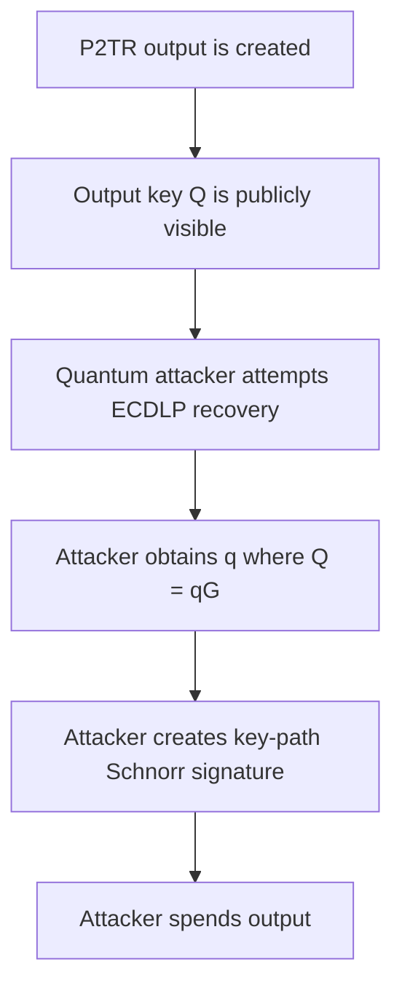

# Taproot Key-Path and Script-Path Considerations

Taproot introduced a new way to represent Bitcoin spending policies. Instead of placing a complete script policy directly in an output, a Pay-to-Taproot output commits to a secp256k1 output key and, optionally, a Merkle tree of alternative scripts. A Taproot output can be spent through either:

1. a **key path**, by providing a valid BIP340 Schnorr signature for the Taproot output key.
2. a **script path**, by revealing and satisfying one committed script leaf together with a Merkle proof.

This design provides important privacy and efficiency benefits. A cooperative or ordinary spend can use the key path and reveal only one signature. Complex recovery, timeout or dispute conditions can remain hidden unless they are actually needed. Even when a script path is used, only the selected script leaf and the information needed to prove its inclusion are revealed; unused branches remain hidden.

The same structure is important for post-quantum readiness. Every P2TR output directly exposes an elliptic-curve output key from the moment the output is created. A sufficiently capable quantum computer that can solve the secp256k1 discrete logarithm problem could derive the corresponding output private key and use the key path, even if the wallet intended to spend only through a script path. Taproot therefore presents two different questions:

- How much policy information does each spending path reveal?
- Which quantum-vulnerable public keys are exposed by the output and by each path?

This chapter explains the construction of Taproot outputs, the difference between key-path and script-path spending, the role of Tapscript, the privacy and fee tradeoffs of each path and the implications for post-quantum Bitcoin migration.

## 1. Learning objectives

After reading this chapter, a reader should be able to explain:

1. What a P2TR output commits to.
2. The difference between the Taproot internal key and output key.
3. How the script-tree root is combined with the internal key.
4. What data is required for a key-path spend.
5. What data is required for a script-path spend.
6. What a Taproot control block contains.
7. How a node verifies that a script belongs to the committed tree.
8. Why key-path spending is normally smaller and more private.
9. What script-path spending reveals.
10. How Tapscript differs from older Bitcoin Script versions.
11. How `OP_CHECKSIGADD` represents threshold policies.
12. How Taproot provides future script and signature upgrade mechanisms.
13. Why a NUMS internal key does not remove the consensus key path.
14. Why P2TR is exposed to long-exposure quantum attacks.
15. Why adding a post-quantum script leaf does not by itself make P2TR quantum-safe.
16. How BIP360’s proposed P2MR output differs from P2TR.
17. 
## 2. P2TR output structure

A Pay-to-Taproot output is a native SegWit version 1 output with a 32-byte witness program representing an x-only secp256k1 public key. Its `scriptPubKey` has the form:

```text
OP_1 OP_PUSHBYTES_32 <32-byte-output-key>
```

BIP341 calls this 32-byte value the **Taproot output key**. It is directly included in the output, unlike P2PKH, P2WPKH, P2SH, and P2WSH outputs, which normally contain hashes or commitments rather than complete elliptic-curve public keys. A Taproot output conceptually combines:

- an **internal key** \(P\), and
- an optional Merkle root \(m\) committing to one or more script leaves.

The final output key is a tweaked public key:

\[
Q=P+tG,
\]

where:

\[
t=
H_{\mathrm{TapTweak}}
\left(
\operatorname{bytes}(P)\parallel m
\right).
\]

Here:

- \(P\) is the internal x-only public key,
- \(m\) is the script-tree root, or an omitted/empty value where applicable,
- \(G\) is the secp256k1 generator,
- \(t\) is the Taproot tweak,
- and \(Q\) is the output key placed in the UTXO.

The tweak cryptographically binds the optional script tree to the output key. A sender only needs the final output key \(Q\); the sender does not need to know the hidden script policy. BIP341 defines this construction and allows the output to be spent either with a signature for \(Q\) or by revealing the internal key, a committed script and the Merkle path proving that script’s inclusion.

## 3. Internal key and output key

The internal key and output key have different roles.

### 3.1 Internal key

The internal key \(P\) is selected by the wallet or protocol constructing the Taproot output. It may represent:

- a single user’s key,
- an aggregate key created by several participants,
- a cooperative signing condition,
- or a Nothing-Up-My-Sleeve point whose discrete logarithm is not known to the participants.

The internal key is not directly placed in the output. It is combined with the Taproot tweak to create the output key.

### 3.2 Output key

The output key \(Q\) is the tweaked secp256k1 public key included in the P2TR witness program. It is the public key used to verify a key-path spend. If the internal secret key is \(p\), the corresponding tweaked secret key is conceptually:

\[
q=p+t\pmod n,
\]

subject to BIP340’s x-only key parity conventions. The relationship is:

\[
Q=qG=P+tG.
\]

A party capable of computing the tweaked private scalar \(q\) can sign directly for the output key and spend through the key path.

### 3.3 The script commitment is hidden

An observer who sees \(Q\) cannot ordinarily determine:

- whether a script tree exists,
- how many script leaves exist,
- what those scripts contain,
- or which internal key was used.

This is one of Taproot’s main privacy properties. A key-path spend remains indistinguishable from a Taproot output that had no practically usable script path. A complex multiparty contract can therefore look like an ordinary single-key spend when participants cooperate. BIP341 identifies this as a primary privacy and efficiency motivation for Taproot.

## 4. Constructing the script tree

Taproot scripts are organized into a Merkle tree. Each leaf contains:

- a leaf version,
- and a script.

For current Tapscript leaves, the leaf version is based on `0xc0`. A leaf hash is computed conceptually as:

\[
k_{\mathrm{leaf}}
=
H_{\mathrm{TapLeaf}}
\left(
v
\parallel
\operatorname{CompactSize}(|s|)
\parallel
s
\right),
\]

where:

- \(v\) is the leaf version,
- \(s\) is the serialized script,
- and \(|s|\) is the script length.

Two child hashes are combined using the tagged `TapBranch` hash. The two values are placed in lexicographic order before hashing:

\[
k_{\mathrm{parent}}
=
H_{\mathrm{TapBranch}}
\left(
\min(k_L,k_R)
\parallel
\max(k_L,k_R)
\right).
\]

This process continues until one Merkle root \(m\) remains. The root is then included in the Taproot tweak that produces \(Q\). BIP341 uses tagged hashes for `TapLeaf`, `TapBranch`, and `TapTweak` to provide domain separation between these cryptographic contexts.

## 5. Key-path spending

A Taproot output uses the key path when, after removing an optional annex, the witness contains exactly one element. That element is interpreted as a BIP340 Schnorr signature for the Taproot output key \(Q\). A simplified key-path witness is:

```text
<signature>
```

The signature is normally:

- 64 bytes when `SIGHASH_DEFAULT` is used, or
- 65 bytes when an explicit sighash byte is appended.

BIP341 verifies this signature directly against the x-only output key contained in the P2TR output.

## 5.1 What a key-path spend reveals

A key-path spend normally reveals:

- one Schnorr signature,
- the transaction fields committed to by that signature,
- and no script.

It does not reveal:

- the internal key,
- whether a script tree exists,
- the script-tree root,
- any fallback conditions,
- the number of script leaves,
- or any unused policy.

This makes key-path spending the most private and compact Taproot spending path.

## 5.2 Cooperative spending

For multiparty protocols, the internal key may be an aggregate public key produced from several participants’ keys. The participants can cooperate through a protocol such as MuSig-style signing to produce one BIP340-compatible signature. On-chain, the result looks like an ordinary single-key Taproot spend:

```text
<one Schnorr signature>
```

The blockchain does not necessarily reveal:

- how many participants were involved,
- whether the output represented multisignature custody,
- or what threshold or cooperative process was used off-chain.

BIP341 specifically identifies key aggregation and threshold signing as reasons why many complex applications can use the efficient key path.

## 5.3 Advantages of key-path spending

Key-path spending provides:

- the smallest Taproot witness,
- no script disclosure,
- no Merkle proof,
- no control block,
- strong policy privacy,
- and compatibility with Schnorr key aggregation.

A key-path spend also avoids revealing that any recovery or dispute path exists.

## 5.4 Limitations of key-path spending

The key path is appropriate only when the required signer or group of signers can cooperate. It may become unavailable if:

- a signer loses a key,
- one participant refuses to cooperate,
- a threshold cannot be reached,
- a device fails,
- or the normal cooperative protocol aborts.

These cases motivate script-path fallback conditions.

## 6. Script-path spending

A Taproot output uses the script path when, after removing an optional annex, the witness contains at least two elements. The final two elements are interpreted as:

1. the selected script; and
2. the control block.

Any earlier witness elements form the initial stack used to execute the script. A simplified script-path witness is:

```text
<script-input-1>
<script-input-2>
...
<selected-script>
<control-block>
```

BIP341 defines this structure and uses the control block to prove that the revealed script was committed to by the output key.

## 6.1 What a script-path spend reveals

A script-path spend reveals:

- the selected script leaf,
- the leaf version,
- the witness values satisfying that script,
- the internal key,
- the output-key parity bit,
- and the Merkle sibling hashes needed to reconstruct the script-tree root.

It does not reveal:

- the complete script tree,
- unused scripts,
- unused branches,
- or the contents of sibling subtrees.

The observer learns that a script path was available and used, but learns only the executed branch and the authentication path needed to verify it.

## 6.2 Example script paths

A Taproot tree might include leaves for:

- one user spending after a timeout,
- a recovery key spending after a longer timeout,
- two parties resolving a dispute,
- a threshold of independent keys,
- an emergency recovery procedure,
- or a hashlocked contract branch.

For example:

```text
Leaf A:
<cooperative-recovery-key> OP_CHECKSIG

Leaf B:
<90-day-lock> OP_CHECKLOCKTIMEVERIFY OP_DROP
<backup-key> OP_CHECKSIG

Leaf C:
<key-1> OP_CHECKSIG
<key-2> OP_CHECKSIGADD
<key-3> OP_CHECKSIGADD
2 OP_NUMEQUAL
```

Only the leaf actually used is revealed.

## 7. The control block

The control block proves that the disclosed script belongs to the Taproot commitment. For a Merkle path with \(m\) sibling hashes, the control block has length 33+32m bytes. It contains:

1. a control byte;
2. the 32-byte internal key; and
3. \(m\) 32-byte Merkle sibling hashes.

BIP341 permits Merkle paths with depths from 0 through 128.

## 7.1 Control byte

The control byte contains:

- the leaf version in its upper seven bits; and
- one parity bit associated with the output key’s \(y\)-coordinate.

The parity bit is necessary because Taproot outputs use only the 32-byte x-coordinate of the output key.

## 7.2 Reconstructing the commitment

A validating node performs the following high-level steps:

1. Hash the revealed script and leaf version using `TapLeaf`.
2. Combine the leaf hash with each sibling in the control block using `TapBranch`.
3. Recover the Merkle root.
4. Combine the internal key and Merkle root using `TapTweak`.
5. Reconstruct the output key \(Q\).
6. Verify that its x-coordinate and parity match the P2TR witness program and control block.
7. Execute the revealed script using the preceding witness elements as the initial stack.

If any step fails, the spend is invalid.

## 7.3 Depth affects witness size

Each additional level in the Merkle path adds 32bytes to the control block. A frequently used script should therefore generally be placed at a shallow depth, while rarely used recovery paths can be placed deeper. BIP341 suggests organizing scripts according to their expected spending probabilities and notes that a Huffman-style tree can minimize expected witness size when path probabilities are known.

## 8. Optional annex

BIP341 reserves an optional witness element called the **annex**. When the witness has at least two elements and the final element begins with byte `0x50`, that element is treated as the annex and removed before determining whether key-path or script-path spending is being used. The annex:

- is covered by the transaction signature,
- contributes to transaction weight,
- is otherwise ignored by current Taproot validation,
- and provides room for future protocol extensions.

The annex is not generally used by current wallets, but it illustrates how Taproot was designed with forward-compatible extension points.

## 9. Tapscript

BIP342 defines the script rules used for current Taproot script-path leaves. This language is commonly called **Tapscript**. Tapscript introduces several important changes:

- BIP340 Schnorr signatures replace ECDSA for signature opcodes;
- `OP_CHECKSIGADD` is added;
- `OP_CHECKMULTISIG` and `OP_CHECKMULTISIGVERIFY` are disabled;
- new signature-operation budgeting is used;
- unknown public-key types provide a future signature-upgrade mechanism;
- and `OP_SUCCESS` opcodes provide a cleaner way to introduce future operations through soft forks.

## 9.1 Signature opcodes

For a 32-byte public key, Tapscript interprets the key as a BIP340 x-only public key. The main signature-related opcodes are:

```text
OP_CHECKSIG
OP_CHECKSIGVERIFY
OP_CHECKSIGADD
```

These validate BIP340 Schnorr signatures under the current Tapscript rules.

## 9.2 `OP_CHECKSIGADD`

`OP_CHECKSIGADD` supports threshold policies by adding one to a numeric accumulator when a supplied non-empty signature is valid. For example, a 2-of-3 policy can be represented conceptually as:

```text
<key-1> OP_CHECKSIG
<key-2> OP_CHECKSIGADD
<key-3> OP_CHECKSIGADD
2 OP_NUMEQUAL
```

This avoids the legacy `OP_CHECKMULTISIG` design and is compatible with batch-verifiable Schnorr signatures. BIP342 describes `OP_CHECKSIGADD` as the replacement mechanism for expressing script-level threshold policies after disabling `OP_CHECKMULTISIG`.

## 9.3 Signature-operation budget

Tapscript does not use the older block-wide signature-operation accounting model for these checks. Instead, each input has a sigops budget based on its witness size:

\[
50+\text{serialized witness size}.
\]

Each executed signature opcode with a non-empty signature reduces that budget by 50. If the budget becomes negative, script execution fails. The current 520-byte maximum stack-element size and the overall stack-element-count limit also remain applicable. These limits are important for future post-quantum integration. A new signature mechanism cannot simply assume that arbitrarily large public keys or signatures fit naturally into existing Tapscript witness semantics.

## 10. Key path versus script path

| Property | Key path | Script path |
|---|---|---|
| Main witness data | One Schnorr signature | Script inputs, script, control block |
| Public key used | Taproot output key | Keys or other conditions in selected script |
| Script revealed | No | Selected leaf only |
| Internal key revealed | No | Yes |
| Merkle path revealed | No | Yes |
| Unused leaves revealed | No | No |
| Typical witness size | Smaller | Larger |
| Policy privacy | Highest | Reveals selected policy |
| Cooperative use | Well suited | Usually fallback or exceptional path |
| Threshold representation | Aggregated/threshold signature | `OP_CHECKSIGADD` or other script |
| Quantum output-key exposure | Present | Present, because same P2TR output key exists |

## 11. Privacy considerations

Taproot improves policy privacy, but the two paths reveal different information.

## 11.1 Key-path privacy

A key-path spend does not reveal whether scripts existed. The observer sees:

- a P2TR output,
- and one Schnorr signature.

The spend may represent:

- one user,
- several cooperating users,
- a multisignature arrangement,
- the cooperative close of a contract,
- or a complex protocol.

These cases can appear structurally similar on-chain.

## 11.2 Script-path privacy

A script-path spend reveals that:

- the key path was not used,
- a script path existed,
- the selected script was valid,
- and the script appeared at a particular Merkle depth.

The revealed leaf may expose:

- public keys,
- threshold structure,
- timelocks,
- recovery logic,
- hashlocks,
- and protocol-specific constants.

The control-block length also reveals the depth of the selected leaf, which establishes a lower bound on the structure of the tree and can sometimes contribute to wallet fingerprinting or clustering. BIP341 notes that script-path spending leaks more policy information than key-path spending and that leaf depth can reveal information about the tree or wallet construction.

## 11.3 Unused leaves remain hidden

A script-path spend does not reveal sibling scripts. The observer receives sibling hashes, not their preimages. As a result, the observer can verify that the selected leaf was committed without learning the unused spending conditions. This is a major improvement over P2SH and P2WSH, where the complete redeem or witness script is revealed when spent, including unused conditional branches within that script.

## 11.4 Key and leaf reuse

BIP341 recommends using fresh keys and avoiding reuse across Taproot leaves and outputs. Reusing:

- internal keys,
- output policies,
- script leaves,
- or Merkle branches

can allow observers to correlate transactions or infer hidden tree structure. In a post-quantum context, key reuse can also turn a previously hidden script key into a long-exposure target once the key is revealed elsewhere.

## 12. Fee and weight considerations

Key-path spending is normally the least expensive Taproot spend because its witness generally contains only one 64-byte Schnorr signature. Script-path spending additionally requires:

- the script-satisfaction stack,
- the selected script,
- the control block,
- and the Merkle path.

The control block alone contains 33+32m bytes before its CompactSize length prefix, where \(m\) is the script depth. Consequently:

- shallow leaves are cheaper than deep leaves;
- compact scripts are cheaper than complex scripts;
- and the key path is usually cheaper than an equivalent script path.

These differences create a deliberate tradeoff:

```text
Key path:
lowest cost and least disclosure

Script path:
greater policy flexibility and recovery options
```

## 13. Selecting the internal key

BIP341 gives several general recommendations for choosing the internal key.

### 13.1 Most likely single-key condition

Where one likely spending condition can be represented by one key, that key can be used as the internal key. This gives the most likely spend:

- the smallest witness,
- the strongest policy privacy,
- and the simplest on-chain appearance.

### 13.2 Aggregate cooperative key

For a multiparty application, the internal key may aggregate all participants. This creates an “everyone cooperates” key path while placing non-cooperative, timeout, or recovery cases in script leaves.

### 13.3 NUMS internal key

If no acceptable key-path condition exists, BIP341 permits using a **Nothing-Up-My-Sleeve** point with no known discrete logarithm. The wallet may randomize a standard NUMS point so that observers cannot easily identify that the key path is intentionally unusable. Classically, this means the participants do not know a private scalar that can spend through the key path. This technique does not remove the key path from the consensus rules. It only makes the output-key secret unknown under the classical discrete-log assumption.

## 14. Designing the script tree

A Taproot tree should be designed around expected spending behaviour.

### 14.1 Separate execution paths into leaves

Where practical, independent policy branches can be represented as separate leaves rather than one large script with many `OP_IF` branches. This provides:

- less disclosure,
- smaller executed scripts,
- and independent control over tree depth.

### 14.2 Put likely paths near the root

Frequently used leaves should generally have shorter Merkle paths. Rare emergency recovery paths can be placed deeper because their larger witness cost is paid less often.

### 14.3 Distinguish normal and emergency paths

A common design is:

```text
Key path:
normal cooperative spending

Shallow script leaf:
common recovery or threshold fallback

Deeper script leaf:
rare long-timeout emergency recovery
```

### 14.4 Account for backup requirements

A wallet that may need script-path recovery must retain enough information to reconstruct:

- the internal key,
- every relevant script,
- leaf versions,
- tree structure,
- key derivation paths,
- and control blocks or the data needed to derive them.

A seed alone may not be sufficient if the wallet cannot reproduce the script policy and tree layout. BIP86 defines a common derivation scheme for simple single-key P2TR wallets, partly because seed-only backups often lack script and derivation metadata. More complex script-tree wallets generally require descriptors or equivalent policy backups.

## 15. Key aggregation and quantum considerations

Taproot’s key path is attractive for collaborative custody because several participants can produce one aggregate public key. Under classical assumptions, no single participant may possess the complete aggregate private key. Signing requires cooperation among the authorized participants. However, the aggregate output key remains one secp256k1 point:

\[
Q=qG.
\]

A sufficiently capable quantum attacker solving the discrete logarithm for \(Q\) would obtain the aggregate scalar \(q\). The attacker would not need to reconstruct:

- each participant’s original key,
- each signer’s share,
- the MuSig transcript,
- or the threshold protocol.

The attacker could produce an ordinary valid key-path signature for \(Q\). This means key aggregation improves privacy and efficiency, but does not provide post-quantum protection.

## 16. Script-path threshold policies and quantum considerations

A script path may require multiple signatures using `OP_CHECKSIGADD`. For example, a 2-of-3 Tapscript leaf may require two valid Schnorr signatures. If the leaf keys remain hidden until spending, they may avoid long exposure individually. When the script-path transaction is broadcast, however, the script reveals all three public keys. A sufficiently fast quantum attacker would need to recover enough private keys to satisfy the threshold before the legitimate transaction confirms. This gives the leaf a short-exposure threat model. However, for P2TR the attacker may not need to attack the leaf at all. The P2TR output key is already exposed and provides a separate key-path route. If the attacker can recover the output private key, all leaf conditions—including:

- threshold requirements,
- timelocks,
- recovery conditions,
- and hashlocks—

can be bypassed through a valid key-path signature.

## 17. P2TR and long-exposure quantum risk

Every P2TR output contains a complete x-only secp256k1 output key. The output key is visible from the moment the UTXO is created. This gives a quantum attacker as much time as the UTXO remains unspent to attempt recovery of the output private key. BIP360 classifies P2TR as vulnerable to long-exposure attacks and proposes removing the key-path spend in a new output type. The attack flow is:



The attacker does not need:

- the internal key,
- the script-tree root,
- any script leaf,
- a control block,
- or the legitimate participants’ cooperation.

## 18. Why a NUMS internal key does not remove quantum exposure

A NUMS internal key is useful when a wallet wants no known classical key-path secret. Under the classical ECDLP assumption:

- participants do not know the internal private key;
- they cannot calculate the tweaked output private key;
- and the output is practically spendable only through a script path.

However, the blockchain does not know that the internal key was NUMS-based. The consensus rules still define the 32-byte witness program as a Taproot output key \(Q\), and a valid Schnorr signature for \(Q\) is still a valid key-path spend. A quantum attacker need not discover how \(P\) was constructed. The attacker targets the final output key directly:

\[
Q=qG.
\]

Recovering \(q\) is sufficient. Therefore:

> A NUMS internal key removes a known classical key-path secret; it does not remove the key path or make the output key post-quantum secure.

## 19. Why a post-quantum script leaf is not enough for P2TR

Suppose a Taproot tree contains a future post-quantum signature leaf:

```text
<PQ-public-key> <future-PQ-check-operation>
```

The legitimate owner could use that leaf without exposing a vulnerable elliptic-curve script key. Nevertheless, the P2TR output still exposes \(Q\). A quantum attacker able to solve secp256k1 ECDLP could ignore the post-quantum leaf and spend through the key path. The output would therefore have:

```text
Quantum-safe script path
but
quantum-vulnerable key path
```

The weaker path determines the output’s effective security. This is one of the main motivations behind proposals to remove or disable the Taproot key path for post-quantum migration. BIP360 proposes P2MR as a script-tree output with the key path and internal key omitted.

## 20. Tapscript upgrade mechanisms

Taproot and Tapscript include several mechanisms that may support future changes.

## 20.1 New leaf versions

Every script leaf includes a version. Current Tapscript uses leaf version `0xc0`, while other versions can be assigned new semantics through future soft forks. A future leaf version could define:

- different stack rules,
- different limits,
- new signature formats,
- or a new script language.

BIP341 intentionally associates each leaf with a version to permit future extensions.

## 20.2 Unknown public-key types

Under current Tapscript rules:

- a 32-byte public key is interpreted as a BIP340 key;
- a zero-length key fails;
- another non-zero length is treated as an unknown public-key type.

Unknown public-key types are designed as an upgrade hook. A future soft fork can assign actual signature-validation semantics to a new key encoding. Before such a definition exists, an unknown key type must not be treated by wallet developers as a secure authorization mechanism.

## 20.3 `OP_SUCCESS` opcodes

Tapscript reserves a set of `OP_SUCCESS` opcodes. When encountered under current rules, they make the script succeed. A future soft fork can redefine one of these opcodes to impose additional conditions. This provides a cleaner upgrade mechanism than older `OP_NOP`-based designs. BIP342 identifies `OP_SUCCESS` as a way to add new opcodes in future soft forks.

## 20.4 Annex

The annex is another reserved extension field. Because it is covered by the signature and contributes to transaction weight, future rules may assign meaning to it without changing the basic Taproot witness structure.

## 21. Post-quantum signature integration considerations

Tapscript’s upgrade mechanisms may help introduce post-quantum validation, but several questions remain.

### 21.1 Signature encoding

A future design must specify:

- how the PQ public key is encoded,
- how the signature is encoded,
- whether they occupy one or several stack elements,
- and how malformed values are rejected.

### 21.2 Stack-element size

Current Tapscript retains the 520-byte maximum stack-element size. A signature or public key that does not fit in one element may require:

- segmentation across several elements,
- a new leaf version,
- or other explicitly defined witness semantics.

### 21.3 Verification cost

A future opcode or key type must account for:

- CPU cost,
- memory cost,
- denial-of-service resistance,
- and deterministic validation across implementations.

### 21.4 Sigops accounting

Current Tapscript charges a fixed 50-unit budget cost for a non-empty signature operation. A post-quantum verifier may have a significantly different resource profile, so future consensus rules may need a new cost model.

### 21.5 Transaction weight

Large PQ signatures would increase:

- input weight,
- user fees,
- block-space demand,
- and migration cost.

These implications are considered in later chapters on signature comparison and transaction weight.

### 21.6 Key-path vulnerability remains

Even if Tapscript successfully supports a PQ signature, a P2TR output remains vulnerable through its elliptic-curve key path. Post-quantum Tapscript functionality and post-quantum output security are therefore separate design problems.

## 22. P2TR versus proposed P2MR

BIP360 proposes Pay-to-Merkle-Root as a SegWit version 2 script-tree output. The main structural difference is:

```text
P2TR:
output commits to an elliptic-curve output key
key path or script path

P2MR:
output commits directly to a script-tree root
script path only
```

BIP360 describes P2MR as retaining nearly the same script-tree functionality as P2TR while removing the quantum-vulnerable key path and internal key.

| Property | P2TR | Proposed P2MR |
|---|---|---|
| Output commitment | Tweaked EC output key | Script-tree Merkle root |
| Internal key | Yes | No |
| Key path | Yes | No |
| Script path | Optional | Required |
| Output-level EC public key | Yes | No |
| Minimum spend witness | Schnorr signature | Stack, script, control block |
| Long-exposure EC risk | Yes | Designed to avoid it |
| Short-exposure risk | Present | Depends on leaf signature |
| Current status | Deployed | Draft proposal |

## 22.1 Witness tradeoff

A P2TR key-path witness is normally only a Schnorr signature. A P2MR spend must always reveal:

- the selected leaf,
- its satisfaction stack,
- and a Merkle-path control block.

P2MR therefore gives up the compact key-path witness in exchange for removing the exposed key path. BIP360 also notes that a P2MR script-path control block can be 32 bytes smaller than the equivalent P2TR script-path control block because it does not include an internal key.

## 22.2 P2MR is not automatically fully post-quantum

A P2MR leaf may still use:

- a BIP340 key,
- an ECDSA key,
- or another elliptic-curve condition.

Such a key may remain hidden until spending, reducing long-exposure risk, but can become vulnerable during the short mempool window. BIP360 states that P2MR addresses long-exposure risk but does not by itself protect against short-exposure attacks; future post-quantum signatures may be required for comprehensive protection.

## 23. Wallet backup and recovery considerations

A key-path-only wallet may often recover funds from:

- the seed,
- the derivation path,
- and the known P2TR construction.

BIP86 defines the commonly used `m/86'` derivation structure for single-key P2TR wallets and describes the key-path witness as one signature. A script-tree wallet needs additional information. A robust backup may need to preserve:

- the internal key derivation,
- every script leaf,
- leaf versions,
- tree topology,
- key origins,
- timelock values,
- hashlock information,
- and signer roles.

Without this information, the wallet may still identify the output key but may be unable to reconstruct a valid script-path witness. Descriptors can encode much of this policy information and should be treated as important backup material.

## 24. Open questions

1. Which Taproot upgrade mechanism is most suitable for PQ signatures: new key types, new opcodes, or new leaf versions?
2. How should very large PQ signatures be encoded under stack-element limits?
3. How should verification cost be represented in a future sigops model?
4. Can a post-quantum script leaf be safely used in P2TR if the EC key path is later disabled?
5. Should Bitcoin introduce a new output type such as P2MR or modify the treatment of existing P2TR outputs?
6. How should wallets migrate key-path-only P2TR outputs?
7. How should MuSig and threshold wallets plan for quantum migration?
8. What backup format best preserves complex script trees?
9. How can wallets verify that a NUMS internal key was constructed correctly?
10. Should script-path wallets avoid P2TR today for long-term cold-storage use under a PQ-readiness model?
11. How should leaf probabilities be estimated when constructing tree depth?
12. How should reused Tapscript leaves be detected?
13. Can private script paths improve migration without introducing unacceptable complexity?
14. How should hardware wallets display the difference between key-path and script-path authorization?
15. What should a UTXO exposure classifier infer from a script-path spend?
16. How can a regtest lab clearly demonstrate that the output key exists independently of the internal key?
17. Which PQ signature families can support practical multisignature or threshold use in script leaves?
18. How should annex-based upgrades be evaluated against leaf-version or opcode-based upgrades?
19. Should future PQ outputs retain a cooperative compact path using a PQ aggregate-signature scheme?
20. How should the privacy loss of script-only PQ outputs be balanced against long-exposure protection?

## 25. Summary

A P2TR output combines:

- an internal key,
- an optional script-tree root,
- and a Taproot tweak

to produce a 32-byte secp256k1 output key. The output can be spent through:

```text
Key path:
one Schnorr signature for the output key

Script path:
script inputs + selected script + control block
```

The key path provides:

- the smallest witness,
- the strongest policy privacy,
- and efficient cooperative or aggregate signing.

The script path provides:

- recovery conditions,
- dispute paths,
- timelocks,
- threshold policies,
- and selective disclosure of one committed leaf.

Tapscript supports Schnorr signature checks, `OP_CHECKSIGADD`, new leaf versions, unknown public-key types, `OP_SUCCESS` upgrade hooks, and an optional annex. From a post-quantum perspective, however, every P2TR output exposes the output key from creation. This means:

- P2TR is vulnerable to long-exposure ECDLP attacks;
- a NUMS internal key does not remove the key path;
- aggregate keys remain vulnerable to direct discrete-log recovery;
- script conditions can be bypassed by a recovered output-key secret;
- and a post-quantum script leaf does not secure the output while the EC key path remains.

BIP360’s proposed P2MR output addresses this structural issue by committing directly to a script-tree root and removing the internal key and key path. It trades the compactness of key-path spending for resistance to long-exposure attacks. P2MR still requires an actual post-quantum signature mechanism to protect spending against short-exposure attacks.

The main readiness lesson is:

> Taproot provides strong policy privacy and flexibility, but its exposed elliptic-curve output key remains the controlling security boundary for post-quantum analysis.

## 26. Further reading

Primary specifications:

1. BIP340, *Schnorr Signatures for secp256k1*.
2. BIP341, *Taproot: SegWit version 1 spending rules*.
3. BIP342, *Validation of Taproot Scripts*.
4. BIP86, *Key Derivation for Single Key P2TR Outputs*.
5. BIP360, *Pay-to-Merkle-Root*, currently a draft proposal.
