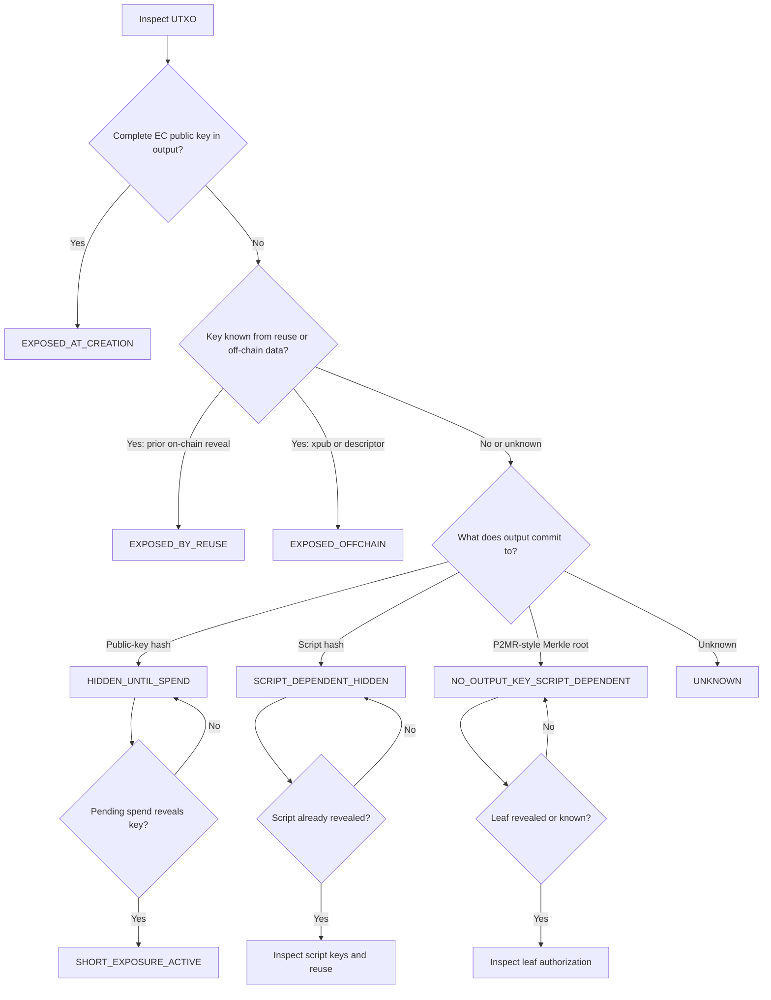

# Bitcoin Address-Type Exposure Matrix

> **Status:** Draft v0.1

## 1. Purpose

This document classifies common Bitcoin output types according to when elliptic-curve public keys and spending scripts become visible. The matrix is intended to support:

- the handbook chapters on Bitcoin address types and public-key exposure;
- the distinction between long-exposure and short-exposure attacks;
- the UTXO exposure-classifier developer lab;
- regtest demonstrations of pre-spend and post-spend visibility;
- wallet, exchange and custodian readiness assessments.

An output’s security also depends on:

- private-key custody;
- wallet implementation;
- signature scheme;
- script correctness;
- threshold policy;
- hash-preimage strength;
- key and script reuse;
- off-chain metadata exposure;
- and future consensus changes.

## 2. Terminology

### Output type

A human-readable Bitcoin address is normally an encoding used by wallets to construct a transaction output. The blockchain contains a `scriptPubKey` or witness program, not the address string itself.

### Complete elliptic-curve public key

A complete elliptic-curve public key includes:

- a compressed secp256k1 public key;
- an uncompressed secp256k1 public key;
- a BIP340 x-only public key;
- or a Taproot output key.

### Long-exposure risk

A complete vulnerable public key is available before the owner begins spending the output, giving an attacker an extended period for quantum key recovery.

### Short-exposure risk

The complete public key becomes visible only when a spending transaction is broadcast. An attacker must recover the corresponding private key and successfully use it before the legitimate transaction confirms.

### Script-dependent exposure

The outer output commits to a script rather than directly revealing its public keys. Exposure depends on:

- the contents of the script;
- whether the script has already been revealed;
- whether its keys have been exposed elsewhere;
- and which spending path is used.

### Fresh output

A **fresh** output assumes that:

- the key or script has not previously been revealed on-chain;
- the address, key, or script has not been reused;
- no xpub or descriptor has exposed the corresponding public key;
- and no other off-chain source has published the relevant key material.

## 3. Exposure categories

| Category | Meaning | Typical examples |
|---|---|---|
| `EXPOSED_AT_CREATION` | A complete elliptic-curve public key is present in the output from creation. | P2PK, bare multisig, P2TR |
| `HIDDEN_UNTIL_SPEND` | The output contains a public-key hash. The full key is expected to be revealed during spending. | Fresh P2PKH, fresh P2WPKH |
| `SCRIPT_DEPENDENT_HIDDEN` | The output contains a script commitment. The script and any embedded public keys remain hidden until spending. | Fresh P2SH, fresh P2WSH |
| `EXPOSED_BY_REUSE` | A key or script that was initially hidden has already been revealed through another transaction or reused output. | Reused P2PKH, reused P2WPKH, reused P2WSH script |
| `EXPOSED_OFFCHAIN` | The key is not visible in the UTXO itself but can be derived or identified from external information. | Exposed xpub, descriptor, watch-only export |
| `SHORT_EXPOSURE_ACTIVE` | A pending transaction has revealed the key or script, creating an active mempool exposure window. | Unconfirmed P2PKH or P2WPKH spend |
| `NO_OUTPUT_KEY_SCRIPT_DEPENDENT` | The output contains no elliptic-curve output key, but the spending script may use vulnerable elliptic-curve signatures. | Draft P2MR |

## 4. On-chain visibility matrix

| Output form | Status | Output commitment | Visible before spending | Revealed during spending |
|---|---|---|---|---|
| P2PK | Legacy | Complete public key | Public key and signature-check condition | Signature |
| Bare multisig (P2MS) | Legacy | Threshold and complete public keys | All public keys, threshold and policy | Required signatures |
| P2PKH | Deployed | `HASH160(public key)` | Public-key hash | ECDSA signature and complete public key |
| P2SH | Deployed | `HASH160(redeemScript)` | Redeem-script hash | Redeem script and satisfaction data |
| P2WPKH | Deployed | Witness v0 + `HASH160(public key)` | Public-key hash | ECDSA signature and complete public key in witness |
| P2WSH | Deployed | Witness v0 + `SHA256(witnessScript)` | Witness-script hash | Witness script and satisfaction data |
| P2SH-P2WPKH | Deployed | P2SH hash of a P2WPKH witness program | Outer script hash only | Inner witness program in `scriptSig`, signature and public key in witness |
| P2SH-P2WSH | Deployed | P2SH hash of a P2WSH witness program | Outer script hash only | Inner witness program in `scriptSig`, witness script and satisfaction data in witness |
| P2TR key path | Deployed | Witness v1 + x-only Taproot output key | Complete x-only output key | Schnorr signature, optional sighash byte |
| P2TR script path | Deployed | Witness v1 + x-only Taproot output key | Complete x-only output key. Scripts remain hidden | Selected leaf script, internal key, control block, Merkle path and satisfaction data |
| P2MR | Draft proposal | Witness v2 + 32-byte script-tree Merkle root | Merkle root. No output-level elliptic-curve key | Selected leaf script, initial stack, control byte and Merkle path. No internal key |

## 5. Quantum-exposure matrix

| Output form | Base category | Complete EC key visible before spend? | Long-exposure risk | Short-exposure risk | Effect of reuse or external disclosure |
|---|---|---:|---|---|---|
| P2PK | `EXPOSED_AT_CREATION` | Yes | Yes | Not a separate hidden-key window. key is already exposed | Other outputs using the same key are also exposed |
| Bare multisig / P2MS | `EXPOSED_AT_CREATION` | Yes, all listed keys | Yes | Keys are already exposed | An attacker normally needs enough recovered keys to satisfy the threshold |
| Fresh P2PKH | `HIDDEN_UNTIL_SPEND` | No | No direct ECDLP target while fresh and unspent | Yes, when the spend reveals the key | A prior reveal changes the classification to `EXPOSED_BY_REUSE` |
| Reused P2PKH | `EXPOSED_BY_REUSE` | Yes, through prior disclosure | Yes | A pending spend may create an additional race, but the key was already exposed | Every UTXO using that key hash may be affected |
| Fresh P2WPKH | `HIDDEN_UNTIL_SPEND` | No | No direct ECDLP target while fresh and unspent | Yes, when the witness reveals the key | A prior reveal changes the classification to `EXPOSED_BY_REUSE` |
| Reused P2WPKH | `EXPOSED_BY_REUSE` | Yes, through prior disclosure | Yes | The key was already exposed before the new spend | Every UTXO using that key hash may be affected |
| Fresh P2SH | `SCRIPT_DEPENDENT_HIDDEN` | Normally no | No direct key exposure at the outer layer | Depends on the redeem script | Revealing or reusing the redeem script may expose keys protecting other outputs |
| Revealed/reused P2SH | `EXPOSED_BY_REUSE` or `UNKNOWN` | Depends on redeem script | Yes if the script contains exposed EC keys | Depends on the active spending path | All outputs using the same redeem script may inherit the exposure |
| Fresh P2WSH | `SCRIPT_DEPENDENT_HIDDEN` | Normally no | No direct key exposure at the outer layer | Depends on the witness script | Revealing or reusing the witness script may expose keys protecting other outputs |
| Revealed/reused P2WSH | `EXPOSED_BY_REUSE` or `UNKNOWN` | Depends on witness script | Yes if the script contains exposed EC keys | Depends on the spending path | All outputs using the same witness script may inherit the exposure |
| Fresh P2SH-P2WPKH | `HIDDEN_UNTIL_SPEND` | No | No direct ECDLP target while fresh | Yes; the witness reveals the public key | Reuse or xpub disclosure changes the classification |
| P2SH-P2WSH | `SCRIPT_DEPENDENT_HIDDEN` | Normally no | Depends on prior script disclosure | Depends on the witness script | Script reuse can create long exposure |
| P2TR key path | `EXPOSED_AT_CREATION` | Yes | Yes | The key is already exposed, so the spend does not create the first exposure | Key aggregation or NUMS construction does not remove output-key exposure |
| P2TR script path | `EXPOSED_AT_CREATION` plus script-path disclosure | Yes, the Taproot output key | Yes | Additional keys in the revealed leaf may enter short exposure | Reused leaf keys or scripts may affect other UTXOs |
| Draft P2MR with EC leaf | `NO_OUTPUT_KEY_SCRIPT_DEPENDENT` | No output-level EC key | No direct long exposure while the leaf and its keys remain hidden | Yes, if spending reveals a vulnerable EC key | Reusing the leaf or key can create long exposure |
| Draft P2MR with future PQ leaf | `NO_OUTPUT_KEY_SCRIPT_DEPENDENT` | No EC output key, assuming the leaf contains no EC key | No EC-key long exposure at output level | Depends on the security of the future PQ authorization mechanism | Conditional on a future specified and reviewed PQ signature design |

## 6. Output-specific notes

### 6.1 P2PK

P2PK places a complete public key directly in the output script.

```text
<public-key> OP_CHECKSIG
```

It is therefore a direct long-exposure target from creation.

### 6.2 Bare multisignature

Bare multisignature places:

- the threshold;
- all participating public keys;
- and the full authorization policy

directly in the output. A quantum attacker normally needs enough recovered private keys to satisfy the threshold.

### 6.3 P2PKH and P2WPKH

Fresh P2PKH and P2WPKH outputs commit to:

```text
HASH160(public key)
```

The complete public key is revealed during spending. Their exposure lifecycle is:

```text
Fresh output
    ↓
HIDDEN_UNTIL_SPEND

Pending spend reveals public key
    ↓
SHORT_EXPOSURE_ACTIVE

Same key protects another UTXO
    ↓
EXPOSED_BY_REUSE
```

P2WPKH moves the public key and signature into the witness, but the key-revelation event is fundamentally similar to P2PKH.

### 6.4 P2SH and P2WSH

P2SH and P2WSH commit to scripts rather than directly to keys. Their classification cannot be determined from the outer output alone. A committed script may contain:

- one public key;
- several public keys;
- a threshold policy;
- hashlocks;
- timelocks;
- nested witness programs;
- or no elliptic-curve public key.

The correct default classification is:

```text
SCRIPT_DEPENDENT_HIDDEN
```

After the script is revealed, the classifier should inspect its contents and determine whether other unspent outputs reuse the same script or keys.

### 6.5 Nested SegWit

For P2SH-P2WPKH and P2SH-P2WSH, the outer P2SH output initially hides even the inner witness program. At spending time:

1. the `scriptSig` reveals the inner witness program;
2. the witness reveals the public key or witness script;
3. the final exposure classification is determined by that inner program.

### 6.6 P2TR key path

A P2TR output directly contains an x-only secp256k1 output key. The output should therefore be classified as:

```text
EXPOSED_AT_CREATION
```

This remains true when:

- the internal key is an aggregate key;
- the wallet intends to use only script paths;
- the internal key is constructed as a NUMS point;
- or no participant knows a classically usable output private key.

A quantum attacker can target the final output key itself.

### 6.7 P2TR script path

A script-path spend reveals:

- the selected script;
- the internal key;
- the control block;
- the Merkle path;
- and script-satisfaction data.

The Taproot output key was already visible, so the UTXO was already in a long-exposure category. The script-path spend may additionally expose public keys contained in the selected leaf.

### 6.8 Draft P2MR

P2MR is a draft proposal, not a deployed Bitcoin output type. It proposes committing directly to a script-tree Merkle root without:

- an internal key;
- a tweaked output key;
- or a key-path spend.

Its base classification is:

```text
NO_OUTPUT_KEY_SCRIPT_DEPENDENT
```

P2MR can reduce long-exposure risk at the output level, but the selected leaf may still reveal an elliptic-curve key during spending.

## 7. Classification decision tree


